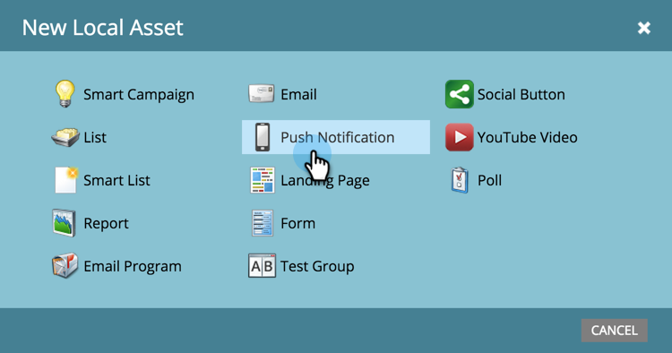

# 建立推播通知 {#create-a-push-notification}

可輕鬆建立推播通知。 不過，在開始之前，您必須讓Marketo管理員和Mobile Apps開發人員設定一些您執行操作時所需的專案。 另請參閱 [瞭解推播通知](/help/marketo/product-docs/mobile-marketing/push-notifications/understanding-push-notifications.md) 以取得詳細資訊。

1. 前往 **行銷活動** 區域。

   

1. 尋找並選取您的程式。

   

1. 在 **新增**，按一下 **新增本機資產**.

   

1. 選取 **推播通知**.

   

1. 輸入 **推播通知名稱** 並按一下 **建立**.

   

   真貼心！ 現在推送通知已建立，接著進行 [打扮一下](/help/marketo/product-docs/mobile-marketing/push-notifications/configure-mobile-push-notification.md).
