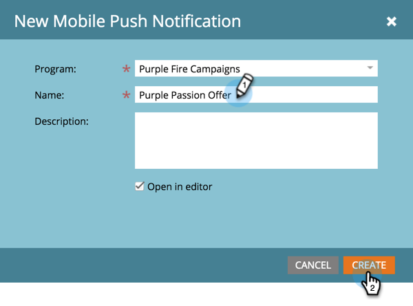

# 建立推播通知 {#create-a-push-notification}

建立推播通知相當容易。 不過，在開始之前，您必須先讓Marketo管理員和行動應用程式開發人員設定您在執行此作業時需要的一些項目。 請參閱 [了解推播通知](/help/marketo/product-docs/mobile-marketing/push-notifications/understanding-push-notifications.md) 以取得詳細資訊。

1. 前往 **行銷活動** 的上界。

   

1. 尋找並選取您的方案。

   

1. 在 **新增**，按一下 **新本機資產**.

   

1. 選擇 **推播通知**.

   

1. 輸入 **推播通知名稱** 按一下 **建立**.

   

   真貼心！ 現在推播通知已建立，接下來 [把它打扮成](/help/marketo/product-docs/mobile-marketing/push-notifications/configure-mobile-push-notification.md).
