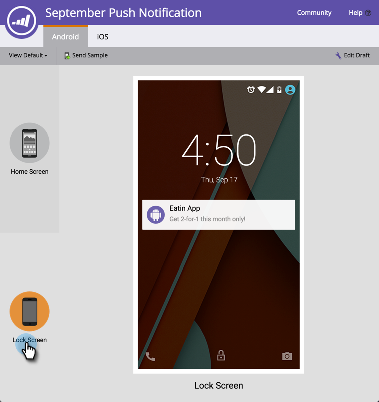
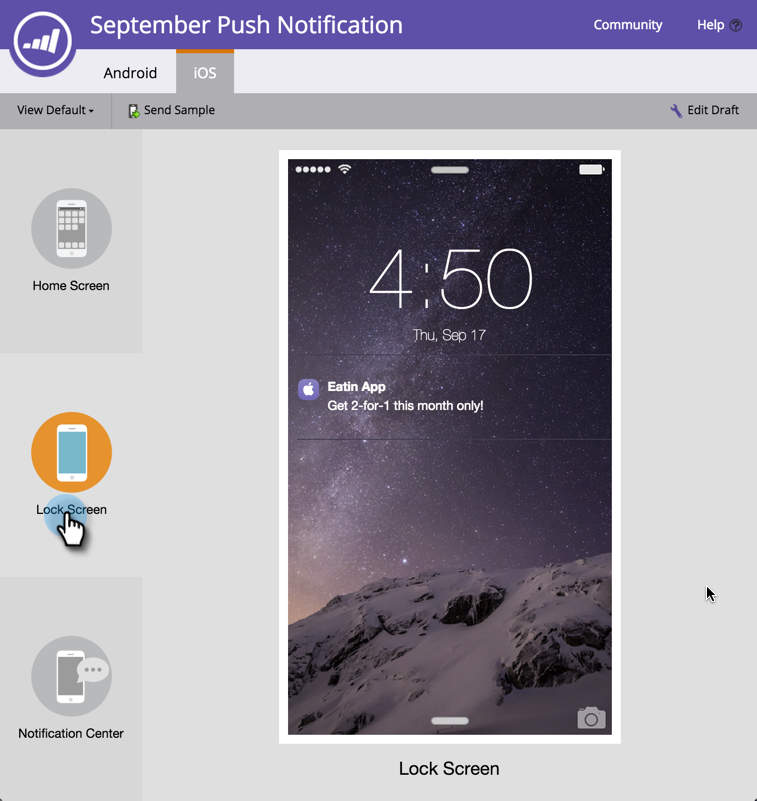

# 預覽推播通知 {#preview-a-push-notification}

不論是Android或iOS，都能輕鬆預覽推播通知的外觀。 有四種方法可以做到。

在導覽樹狀結構中，以滑鼠右鍵按一下要預覽之通知的檔案，然後按一下 **預覽**.

>[!NOTE]
>
>如果僅為一個平台啟用推播通知，則不會顯示另一個平台的索引標籤。

或者，在「推播通知」檢視頁面上，按一下 **推播通知動作** 然後 **預覽**. 或者，按一下 **預覽** 最右邊。

最後，在編輯器中，您可以按一下 **預覽草稿** 標籤填入通知。

## Android預覽 {#android-previews}

按一下左側的圖示，即可確切瞭解當您傳送推播通知時，推播通知會顯示在何處。 按一下或使用鍵盤箭頭在兩者之間切換。

在「首頁」畫面上，通知會顯示在上方圖示下方。

在「鎖定」畫面上，畫面會在時間下方往下彈出。

>[!NOTE]
>
>Android中沒有通知中心檢視。

## iOS預覽 {#ios-previews}

和Android一樣，按一下或使用鍵盤箭頭在檢視之間切換。

在「首頁」畫面上，通知會顯示在頂端。

在「鎖定」畫面上，畫面會往下顯示。

在「通知中心」畫面上，它位於靠近頂端的位置，

因此，透過推播通知預覽，您一律知道客戶將看到什麼！

>[!MORELIKETHIS]
>
>* [建立推播通知](/help/marketo/product-docs/mobile-marketing/push-notifications/create-a-push-notification.md)
>* [設定行動推播通知](/help/marketo/product-docs/mobile-marketing/push-notifications/configure-mobile-push-notification.md)
