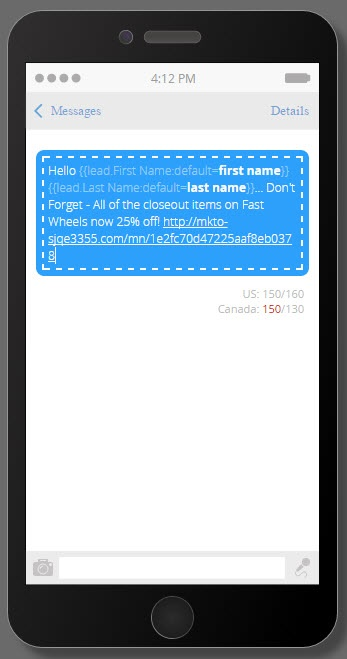

# 建立Vibes SMS訊息 {#create-a-vibes-sms-message}

以下說明如何建立Vibes SMS訊息。

>[!AVAILABILITY]
>
>此功能可作為您的Adobe Marketo Engage帳戶的附加元件使用。 為了適當地布建，必須透過Adobe購買。 如需詳細資訊，請聯絡Adobe客戶團隊（您的客戶經理）。

>[!NOTE]
>
>SMS文字訊息不符合HIPAA標準。

1. 前往 **行銷活動** ，然後以滑鼠右鍵按一下方案。

   

1. 按一下 **新增本機資產**.

   

   >[!TIP]
   >
   >或者，您可以按一下 **新增** 下拉式清單。

1. 按一下 **簡訊訊息**.

   

1. 輸入新SMS訊息的名稱和說明（選用），然後按一下 **建立**.

   

1. 按一下 **編輯草稿**.

   

1. 在訊息編輯器中，在藍色泡泡內按一下，並開始輸入文字。

   

   >[!NOTE]
   >
   >美國和加拿大的限制不同，分別為160和130個字元。 如果超過這些字元限制，則可能會分割您的訊息。 雖然我們會在您超過加拿大限制時顯示，但編輯器已針對美國最佳化，並根據美國限制分割訊息。

1. 按一下 **Token** 在「插入」功能表中新增Token至訊息。

   

   >[!NOTE]
   >
   >新增Token可能會造成訊息超過字元限制。 然後會分割訊息，導致額外費用。

1. 按一下 **連結** 在「插入」功能表中，將連結新增至訊息。

   

1. 選取連結型別。 預設值為「Marketo登陸頁面」。 如果您這麼做，您必須從下拉式清單中選取登入頁面，然後按一下 **插入**.

   

   >[!NOTE]
   >
   >預設會選取這兩個追蹤連結。

1. 如果您想改用外部URL，請按一下 **外部URL** 按鈕，並在URL欄位中輸入URL。 按一下 **插入**.

   

1. 連結會顯示在訊息中。

   

   >[!NOTE]
   >
   >Marketo會顯示品牌追蹤網域的連結預覽。 如果您清除mkt_tok連結核取方塊，則連結會變更。 也清除追蹤連結核取方塊，URL會縮短至其基本長度(例如www.mygooglepage.com)。

   

   >[!NOTE]
   >
   >字元計數僅反映最低訊息中包含的字元。

如果您插入的訊息超過美國的限制，編輯器會將您的訊息分成多個區段。 900個字元的絕對總限製為。 達到此限制後，訊息在傳送給其對象時將會自動截斷。
