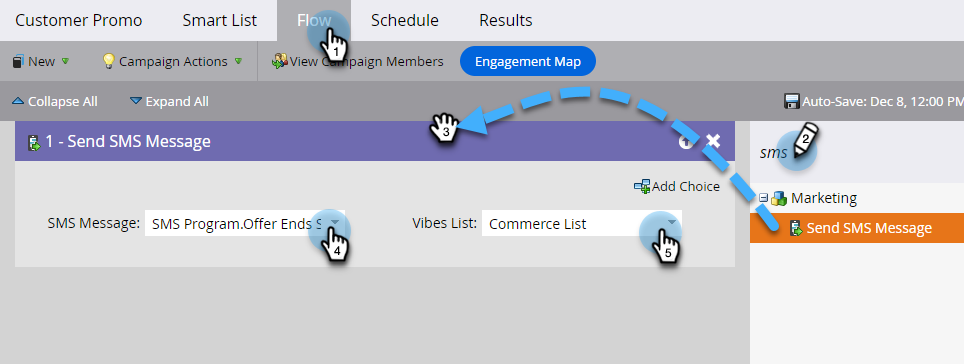

# 傳送簡訊訊息 {#send-a-vibes-sms-message}

您已[建立SMS訊息](/help/marketo/product-docs/mobile-marketing/vibes-sms-messages/create-an-sms-message.md){target="_blank"}，現在可以傳送它了。 您可以透過批次或觸發行銷活動來傳送。

>[!NOTE]
>
>傳送簡訊時：
>
>* 依電話號碼Marketo Engage重複資料刪除。 因此，如果多人擁有相同的電話號碼，則只有一人會收到訊息，前提是他們只有一個Vibes訂閱清單的成員。 去重複化是在Vibes訂閱清單層級，而非Marketo方案層級完成。
>* Marketo不會傳送給已加入封鎖名單或行銷遭暫停的人。
>* SMS訊息不會傳送給任何未訂閱者（如果他們不在Vibes行動資料庫清單中）。

## 傳送批次SMS {#send-a-batch-sms}

1. 在「我的Marketo」中，按一下&#x200B;**行銷活動**。

   

1. 尋找並選取所需的Smart Campaign。

   

1. 按一下&#x200B;**智慧列示**&#x200B;標籤，並定義簡訊的對象。 在此範例中，我們會傳送給資料庫中將「Adobe」列為公司的所有人。

   

1. 在&#x200B;**流量**&#x200B;索引標籤中，拖曳至&#x200B;**傳送簡訊**。 從下拉式清單中選取所需的SMS訊息和訪客清單。

   

   >[!NOTE]
   >
   >「訪客清單」選擇器對於在「智慧清單」中已識別的對象起到進一步的篩選作用，僅將目標定位為屬於該「訪客」清單的人。

1. 按一下&#x200B;**排程**&#x200B;索引標籤，並排程您的簡訊。

   

## 傳送觸發程式SMS {#send-a-trigger-sms}

1. 在「我的Marketo」中，按一下&#x200B;**行銷活動**。

   

1. 尋找並選取所需的Smart Campaign。

   

1. 按一下&#x200B;**智慧列示**&#x200B;標籤，選取所需的觸發程式並定義其值。 在此範例中，我們使用&#x200B;**填寫表單**。

   

1. 在&#x200B;**流量**&#x200B;索引標籤中，拖曳至&#x200B;**傳送簡訊**。 從下拉式清單中選取所需的SMS訊息和訪客清單。

   

   >[!NOTE]
   >
   >「訪客清單」選擇器對於在「智慧清單」中已識別的對象起到進一步的篩選作用，僅將目標定位為屬於該「訪客」清單的人。

1. 按一下「**排程**」標籤，然後按一下「**啟動**」。

   

>[!MORELIKETHIS]
>
>* [建立Vibes訊息](/help/marketo/product-docs/mobile-marketing/vibes-sms-messages/create-an-sms-message.md){target="_blank"}
>* [在智慧行銷活動中使用SMS選項](/help/marketo/product-docs/mobile-marketing/vibes-sms-messages/using-sms-options-in-a-smart-campaign.md){target="_blank"}
