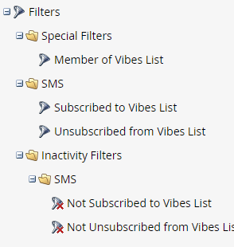

# 在智慧行銷活動中使用簡訊選項 {#using-sms-options-in-a-smart-campaign}

在您之後 [建立簡訊訊息](/help/marketo/product-docs/mobile-marketing/vibes-sms-messages/create-an-sms-message-2.md){target="_blank"}，您就會想要在Smart Campaign中使用智慧列示觸發器和篩選器，以取得優點。

>[!NOTE]
>
>如果您要傳送SMS訊息，我們有 [特定文章](/help/marketo/product-docs/mobile-marketing/vibes-sms-messages/send-an-sms-message.md){target="_blank"} 為了這個。

>[!PREREQUISITES]
>
>SMS觸發器/篩選器僅在以下情況下出現： [已啟用Vibes服務](/help/marketo/product-docs/mobile-marketing/admin/add-vibes-as-a-launchpoint-service.md){target="_blank"}.

## 簡訊觸發程式 {#sms-triggers}

<table style="width:600px">
  <tr>
    <td style="width:50%"></td>
    <td style="width:50%"></td>
  </tr>
</table>

以下是一些範例：

此 **SMS訊息退信** SMS訊息退回時，觸發器會起始流程，例如傳送電子郵件。

此 **Vibes清單的訂閱者** 有人訂閱時，觸發器就會起始流程。

此 **SMS訊息中的點按連結** 當有人點選SMS訊息中的連結時，觸發器就會起始流程。

## 簡訊篩選器 {#sms-filters}

<table style="width:600px">
  <tr>
    <td style="width:50%"></td>
    <td style="width:50%"></td>
  </tr>
</table>

此 **訂閱的視覺效果清單** 篩選器會尋找擁有下列條件的任何人： *永遠* 已訂閱影片。 這包括已取消訂閱和已刪除的人員，即使流程中省略了已刪除的人員。 此篩選器最適合用於報表。

相較之下， **Vibes清單的成員** 篩選器尋找 _任何人_ 目前已訂閱Vibes，最適合用於智慧行銷活動或清單。

>[!NOTE]
>
>所有SMS篩選器包括 **活動日期** 預設為限制。

## 簡訊流程步驟 {#sms-flow-steps}

有三個簡訊流程步驟可供選擇。

<table>
<tbody>
  <tr>
    <td style="width:20%"><b>傳送簡訊訊息</b></td>
    <td>此流程動作會從Marketo智慧清單傳送訊息給訂閱使用者選擇加入的Vibes訂閱清單的使用者。 它不會起始訂閱程式。 <a href="/help/marketo/product-docs/mobile-marketing/vibes-sms-messages/send-an-sms-message.md">瞭解更多</a>.</td>
  </tr>

<tr>
    <td style="width:20%"><b>訂閱Vibes清單</b></td>
    <td>此流程動作會透過使用者選取的Vibes贏取行銷活動來起始簡訊訂閱程式。 然後Vibes會傳送確認訊息，收件者必須在24小時內以「Y」回覆該訊息，以確認選擇加入。 使用者選擇加入後，就會成為您相關Vibes訂閱清單的成員。</td>
  </tr>
  <tr>
    <td style="width:20%"><b>取消訂閱訪客清單</b></td>
    <td>此流量動作會從使用者選擇加入的Vibes訂閱清單中取消訂閱每個人。 當使用者將「STOP」文字傳送到您的程式碼時，其人員記錄會更新，以反映他們不再是Vibes訂閱清單的成員。</td>
  </tr>
  </tbody>
</table>

>[!NOTE]
>
>此 **訂閱Vibes清單** 和 **取消訂閱訪客清單** 流程有不同的需求。 的 **訂閱**，您必須選取Vibes清單和Vibes贏取行銷活動。 的 **取消訂閱**，則只需要變數清單。

>[!MORELIKETHIS]
>
>* [傳送簡訊訊息](/help/marketo/product-docs/mobile-marketing/vibes-sms-messages/send-an-sms-message.md){target="_blank"}
>* [定義Smart Campaign的智慧清單 | 觸發](/help/marketo/product-docs/core-marketo-concepts/smart-campaigns/creating-a-smart-campaign/define-smart-list-for-smart-campaign-trigger.md){target="_blank"}
>* [定義Smart Campaign的智慧清單 | 批次](/help/marketo/product-docs/core-marketo-concepts/smart-campaigns/creating-a-smart-campaign/define-smart-list-for-smart-campaign-batch.md){target="_blank"}
