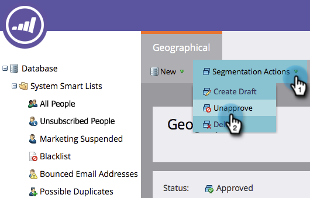

# 刪除分段{#delete-a-segmentation}

您可依照下列步驟刪除區段。

1. 轉至&#x200B;**Database**。

   

1. 前往您的區段，然後按一下「使用者&#x200B;**」以檢查關聯。**

   

   如果您的區段被其他資產使用，請先移除所有關聯，再繼續。

1. 移除所有關聯，然後在&#x200B;**分段動作**&#x200B;中按一下&#x200B;**取消核准**。

   

   >[!NOTE]
   >
   >您可以刪除或使用區段的資產或建立替代項目，以移除關聯。

1. 未核准後，按一下「區段動作&#x200B;**」並刪除區段。**

   

就這樣。 你拿不回來，所以一定要不要了。
