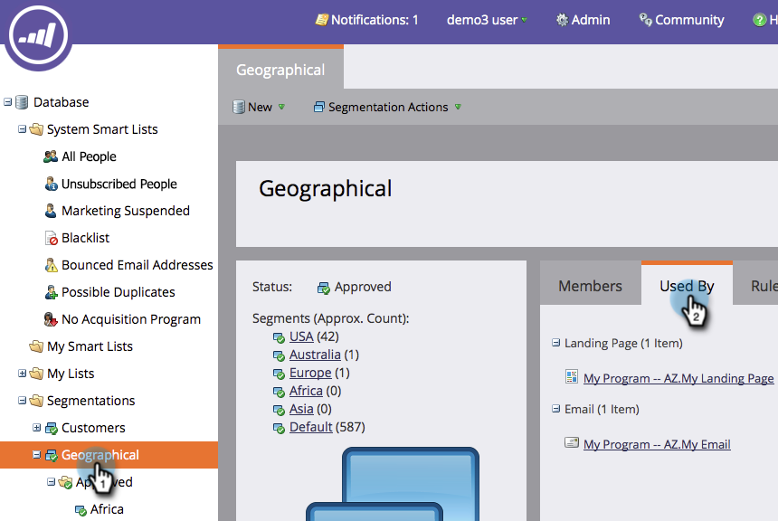

# 刪除分段 {#delete-a-segmentation}

您可以依照下列步驟刪除區段。

1. 前往 **資料庫**.

   

1. 前往您的區段，然後按一下 **使用者** 以檢查關聯。

   

   如果您的區段由其他資產使用，請先移除所有這些關聯，然後再繼續。

1. 移除所有關聯，然後在 **分段動作** 按一下 **取消核准**.

   

   >[!NOTE]
   >
   >您可以刪除或建立使用區段的資產的替代方案，以移除關聯。

1. 取消核准後，按一下 **分段動作** 並刪除分段。

   

就是這樣。 無法取回，因此請確定您不再需要它。
