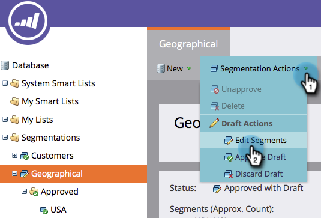

# 編輯區段{#edit-a-segmentation}

變更現有區段很簡單。 下面是低層。

## 建立分段草稿{#create-a-segmentation-draft}

1. 轉至&#x200B;**Database**。

   

1. 在您的區段中，按一下「區段動作」**，然後按一下「建立草稿」**。****

   

1. **狀態**變更為「已核准並含草稿」。 在您的區段中會建立**草稿*資料夾。

   

## 新增、編輯或刪除區段{#add-edit-or-delete-segments}

1. 在區段中，按一下「區段動作」**，然後按一下「編輯區段」**。****

   

   >[!NOTE]
   >
   >您只能編輯草稿的區段，而不能編輯已核准的區段。

1. **新增區段**、**編輯**現有（重新命名或變更順序）或**刪除**任何區段。

   

   >[!NOTE]
   >
   >您必須先選取區段，才能編輯或刪除區段。

   >[!CAUTION]
   >
   >刪除會影響電子郵件、登陸頁面和程式碼片段中所有相關的動態內容。 **沒有撤消**。檢查&#x200B;**使用者**&#x200B;標籤，以瞭解該區段的用途。

## 編輯區段規則{#edit-segment-rules}

1. 在您的草稿&#x200B;**區段**&#x200B;中，前往&#x200B;**智慧清單**。 套用類似於[定義區段規則](https://docs.marketo.com/display/public/DOCS/Define+Segment+Rules)的規則。

   

   >[!NOTE]
   >
   >您無法編輯已核准的區段。 按一下「草稿」檔案夾中的「區段」以進行編輯。

   >[!NOTE]
   >
   >**提醒**
   >
   >
   >請記得核准您的分段草稿。

您可以自由嘗試動態內容中未使用的分段。

>[!MORELIKETHIS]
>
>* [刪除區段](delete-a-segmentation.md)

>

