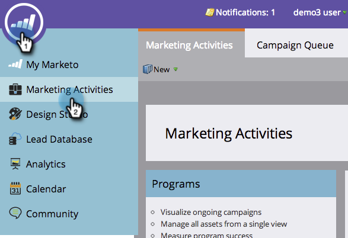

# 依區段將電子郵件報表分組 {#group-email-reports-by-segmentations}

區段不僅僅適用於動態內容。 您也可以依區段將電子郵件效能報表分組。

>[!PREREQUISITES]
>
>[核准分段](/help/marketo/product-docs/personalization/segmentation-and-snippets/segmentation/approve-a-segmentation.md)

1. 前往 **行銷活動** (或 **分析**)區域。

   

1. 選取您的 **電子郵件效能** 報告。

   

1. 按一下 **設定** 定位並拖曳到 **依區段分組**.

   

1. 選擇一或兩個區段來分組報表。 按一下 **套用**.

   

1. 完成了！ 按一下 **報告** 標籤。 如果您使用一個區段，報表會為每個區段顯示一列。

   

1. 如果使用兩個分段，則會分別顯示一列 _組合_ 區段的。

   

>[!MORELIKETHIS]
>
>[篩選電子郵件報表中的資產](/help/marketo/product-docs/reporting/basic-reporting/report-activity/filter-assets-in-an-email-report.md)
