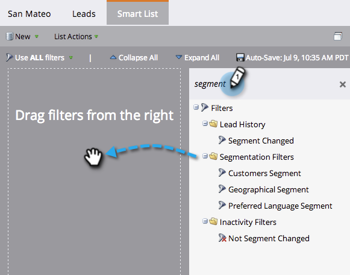

# 在[!UICONTROL Smart List]中使用區段篩選器 {#use-segment-filters-in-a-smart-list}

>[!PREREQUISITES]
>
>* [建立[!UICONTROL Smart List]](/help/marketo/product-docs/core-marketo-concepts/smart-lists-and-static-lists/creating-a-smart-list/create-a-smart-list.md)
>* [建立分段](/help/marketo/product-docs/personalization/segmentation-and-snippets/segmentation/create-a-segmentation.md)

使用區段篩選器最佳化智慧列示效能。

1. 在您建立的智慧清單中，搜尋&#x200B;**區段**&#x200B;這個字，拖放篩選器。

   

太棒了！ 現在您知道如何尋找分段篩選器了。
