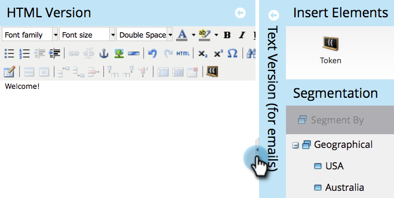

# 將內容新增至程式碼片段 {#add-content-to-a-snippet}

>[!PREREQUISITES]
>
>[建立代碼片段](/help/marketo/product-docs/personalization/segmentation-and-snippets/snippets/create-a-snippet.md)

您可以將Token、影像、檔案或RTF文字新增至程式碼片段。

>[!NOTE]
>
>您無法內嵌任何 [Marketo電子郵件語法](/help/marketo/product-docs/email-marketing/general/email-editor-2/email-template-syntax.md) 在代碼片段中；它會 **not** 在電子郵件中工作。 程式碼片段應該只包含內文內容(HTML+文字)。

1. 前往 **Design Studio**.

   

1. 選取您的 **代碼片段** 並按一下 **編輯草稿**.

   

您可以將三種型別的內容新增至程式碼片段。

## 新增標記 {#add-token}

1. 拖放 **Token** 元素。

   

1. 輸入 **Token** 並按一下 **插入**.

   

## 新增影像/檔案 {#add-image-file}

1. 拖放 **影像/檔案** 元素。

   

   >[!NOTE]
   >
   >您可以將自己的影像或檔案新增至Marketo。 進一步瞭解 [影像和檔案](/help/marketo/product-docs/demand-generation/images-and-files/add-images-and-files-to-marketo.md).

1. 選取 **影像** ，然後按一下 **插入**.

   

   >[!NOTE]
   >
   >如果您知道特定影像的名稱，也可以搜尋該影像。

## 新增文字 {#add-text}

1. 在HTML版本區域中鍵入以新增文字。

   

   >[!TIP]
   >
   >使用格式設定工具來自訂文字。

1. 針對電子郵件，按一下 **文字版本** 標籤。

   

1. 按一下 **從HTML複製**.

   

   >[!NOTE]
   >
   >「文字版本」中的影像、連結和格式設定會遭到移除。

酷！ 現在您可以為程式碼片段建立各種內容。

>[!MORELIKETHIS]
>
>* [預覽代碼片段](/help/marketo/product-docs/personalization/segmentation-and-snippets/snippets/preview-a-snippet.md)
>* [核准代碼片段](/help/marketo/product-docs/personalization/segmentation-and-snippets/snippets/approve-a-snippet.md)
