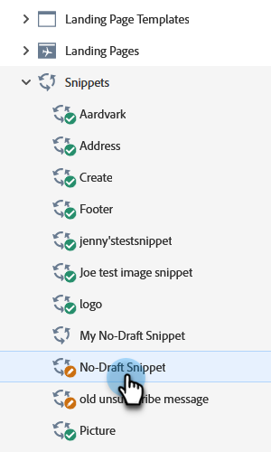

# 核准設定為無草稿的程式碼片段 {#approve-a-snippet-with-no-draft}

## 核准程式碼片段 {#approve-the-snippet}

每次核准程式碼片段時，都不會觸發非草稿。 其中包含其他工作區中資產共用或參考的程式碼片段。

1. 移至&#x200B;**[!UICONTROL Design Studio]**。

   

1. 尋找並選取所需的程式碼片段。

   

1. 從&#x200B;**[!UICONTROL Snippet actions]**&#x200B;下拉式清單中選擇&#x200B;**[!UICONTROL Approve draft]**。

   

1. 在[核准程式碼片段]對話方塊中選取選項，然後按一下&#x200B;**[!UICONTROL Approve]**：

   * **[!UICONTROL Update all]**：此選項不會使用程式碼片段建立已核准資產的草稿。 所有資產都會取得更新，並維持其先前的狀態。 進度模組會顯示在畫面的右上角，您可以隨時將其關閉。 若要還原，請以滑鼠右鍵按一下程式碼片段名稱，然後選取顯示核准狀態。
   * **[!UICONTROL Create drafts]**：此選項會使用程式碼片段建立已核准資產的草稿。 如需先檢閱程式碼片段變更，請選取此選項。 所有草稿都必須手動核准。

   

   >[!NOTE]
   >
   >對於尚未使用的新程式碼片段，不會出現此「核准草稿」畫面。 在一或多個資產中使用程式碼片段時，就會顯示該程式碼片段。

>[!CAUTION]
>
>此功能旨在透過程式碼片段核准工作流程節省時間。 不過，您也應注意幾項限制。 請參閱[本文章](https://nation.marketo.com/t5/knowledgebase/no-draft-snippet-limitations-and-troubleshooting/ta-p/300799){target="_blank"}以取得詳細資料。

>[!MORELIKETHIS]
>
>[啟用程式碼片段的No-Draft](/help/marketo/product-docs/administration/users-and-roles/enable-no-draft-for-snippets.md){target="_blank"}
