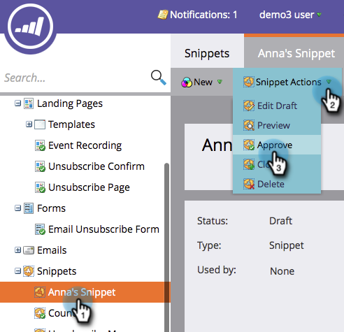

# 核准程式碼片段 {#approve-a-snippet}

>[!PREREQUISITES]
>
>[將內容新增至程式碼片段](/help/marketo/product-docs/personalization/segmentation-and-snippets/snippets/add-content-to-a-snippet.md)

程式碼片段必須先獲得核准才能使用。

1. 前往 **Design Studio**.

   

1. 按一下 **程式碼片段**. 在 **程式碼片段動作**，按一下 **核准**.

   

就這樣！ 程式碼片段的狀態會從草稿變更為已核准。

>[!MORELIKETHIS]
>
>[以非草稿方式核准程式碼片段](/help/marketo/product-docs/personalization/segmentation-and-snippets/snippets/approve-a-snippet-with-no-draft.md)
