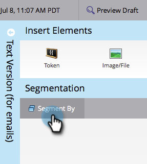

# 使用動態內容編輯程式碼片段 {#edit-snippets-with-dynamic-content}

>[!PREREQUISITES]
>
>* [建立分段](/help/marketo/product-docs/personalization/segmentation-and-snippets/segmentation/create-a-segmentation.md)
>* [建立程式碼片段](/help/marketo/product-docs/personalization/segmentation-and-snippets/snippets/create-a-snippet.md)

使用片段中的分段輕鬆管理電子郵件和登入頁面上的動態內容。

## 新增分段 {#add-segmentation}

1. 移至&#x200B;**[!UICONTROL Design Studio]**。

   

1. 按一下您的&#x200B;**程式碼片段**，然後按一下&#x200B;**[!UICONTROL Edit Draft]**。

   

1. 按一下&#x200B;**[!UICONTROL Segment By]**。

   

1. 輸入&#x200B;**[!UICONTROL Segmentation]**&#x200B;並按一下&#x200B;**[!UICONTROL Save]**。

   

## 套用動態內容 {#apply-dynamic-content}

1. 按一下&#x200B;**區段**，然後編輯內容。 對每個區段重複

   

>[!NOTE]
>
>使用程式碼片段前，請記得先核准該程式碼片段。

不是很簡單嗎？ 您現在已準備好在電子郵件和登入頁面上使用這些程式碼片段。

>[!MORELIKETHIS]
>
>* [新增程式碼片段至電子郵件](/help/marketo/product-docs/email-marketing/general/functions-in-the-editor/add-a-snippet-to-an-email.md)
>* [將程式碼片段新增至登陸頁面](/help/marketo/product-docs/demand-generation/landing-pages/personalizing-landing-pages/add-a-snippet-to-a-landing-page.md)
