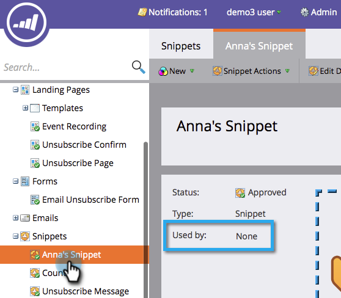

# 取消核准程式碼片段{#unapprove-a-snippet}

未核准的程式碼片段無法用於電子郵件或登陸頁面。

1. 前往&#x200B;**Design Studio**。

   

1. 前往您的「程式碼片段」並確定它不是&#x200B;**Used By**&#x200B;任何資產。

   

   如果您的程式碼片段被其他資產使用，請先移除這些關聯，然後再繼續。

1. 在&#x200B;**程式碼片段動作**&#x200B;中，按一下&#x200B;**取消核准**。

   

就這樣！ 您的程式碼片段現在處於草稿狀態，可供您進行變更或刪除。
