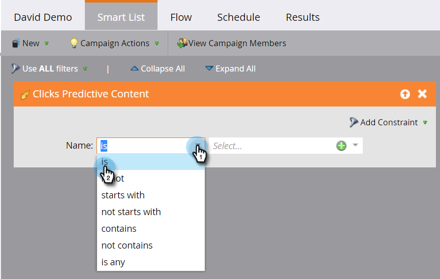

# 定義預測性內容活動的智慧清單{#define-a-smart-list-for-predictive-content-activities}

在智慧型促銷活動中定義智慧型清單時，您可以在觸發器和篩選器中使用預測性內容活動。 您可以透過[豐富型媒體範本](/help/marketo/product-docs/predictive-content/enabling-predictive-content/enable-predictive-content-for-web-rich-media.md)、[內容建議列](/help/marketo/product-docs/predictive-content/enabling-predictive-content/enable-the-content-recommendation-bar.md)或[電子郵件](/help/marketo/product-docs/predictive-content/enabling-predictive-content/enable-predictive-content-in-emails.md)，觸發任何點按預測性內容的人的動作。

1. 在智慧型促銷活動中，導覽至&#x200B;**智慧型清單**&#x200B;標籤。

   

   >[!NOTE]
   >
   >智慧型清單可以做出令人驚艷的事。 進一步瞭解[智慧型清單深入探討](/help/marketo/product-docs/core-marketo-concepts/smart-campaigns/understanding-smart-campaigns.md)。

1. 搜尋觸發器，然後將其拖放至畫布上。

   

   >[!NOTE]
   >
   >具有觸發器的智慧型促銷活動會在觸發器模式中執行。 它會根據觸發的事件和新增的篩選條件，一次在一個人上執行。

1. 按一下&#x200B;**名稱**&#x200B;下拉式清單並選取運算子。

   

1. 定義觸發器。

   

1. 添加&#x200B;**Type**&#x200B;約束。

   

1. 選擇智慧清單所需的源。

   

1. 如果您使用電子郵件來源做為預測性內容，請新增「電子郵件&#x200B;**中的「點按連結」觸發器。**&#x200B;選擇您的電子郵件並添加&#x200B;**Is Predictive**&#x200B;約束，定義為&#x200B;**true**。

   

1. 視需要新增任何其他篩選器。

   

   >[!TIP]
   >
   >在具有觸發器和篩選器的智慧型促銷活動中，觸發器會移至頂端。 觸發時，只有符合篩選條件的人才會瀏覽流程。

   >[!NOTE]
   >
   >如果有多個觸發器，當任一個觸發器被啟動時，人員會進入流程。

   若要同時在一組人員上執行促銷活動，請瞭解如何[定義批次智慧型促銷活動的智慧清單](/help/marketo/product-docs/core-marketo-concepts/smart-campaigns/creating-a-smart-campaign/define-smart-list-for-smart-campaign-batch.md)。

   >[!MORELIKETHIS]
   >
   >* [定義智慧型促銷活動的智慧型清單 |批次](/help/marketo/product-docs/core-marketo-concepts/smart-campaigns/creating-a-smart-campaign/define-smart-list-for-smart-campaign-batch.md)
   >* [新增流量步驟至智慧型促銷活動](/help/marketo/product-docs/core-marketo-concepts/smart-campaigns/flow-actions/add-a-flow-step-to-a-smart-campaign.md)
   >* [為Web個人化活動定義智慧清單](/help/marketo/product-docs/web-personalization/working-with-web-campaigns/define-a-smart-list-for-web-personalization-activities.md)
   >* [為網頁豐富式媒體啟用預測式內容](/help/marketo/product-docs/predictive-content/enabling-predictive-content/enable-predictive-content-for-web-rich-media.md)
   >* [啟用內容建議列](/help/marketo/product-docs/predictive-content/enabling-predictive-content/enable-the-content-recommendation-bar.md)

