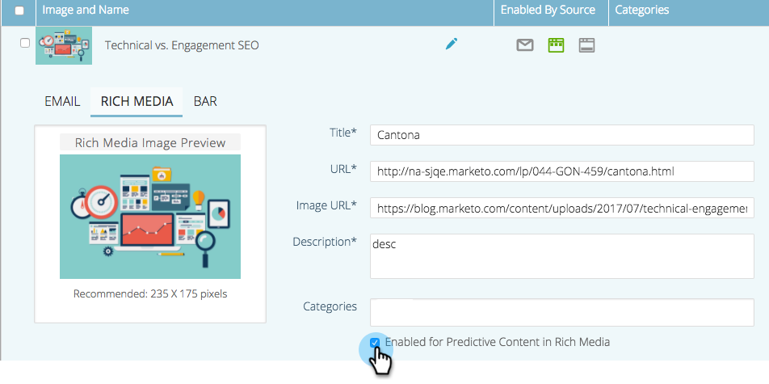

# 為Web多媒體啟用預測性內容 {#enable-predictive-content-for-web-rich-media}

預測性內容與網站訪客的互動，最相關的內容由機器學習和預測性分析提供技術支援。 透過網頁多媒體，您可以透過文字說明和影像增強內容，並在網站上內嵌多個預測性內容建議。

>[!NOTE]
>
>建議您在測試和使用預測內容之前，先為每個類別和每個來源（電子郵件、多媒體、長條）啟用超過5個內容片段。 更多內容可讓您獲得更好的預測結果。

>[!PREREQUISITES]
>
>啟用預測內容之前，您必須：
>
>* **準備預測內容**
   >
   >   * [編輯電子郵件的預測內容](/help/marketo/product-docs/predictive-content/working-with-predictive-content/edit-predictive-content-for-emails.md){target=&quot;_blank&quot;}或
   >   * [編輯多媒體的預測內容](/help/marketo/product-docs/predictive-content/working-with-predictive-content/edit-predictive-content-for-rich-media.md){target=&quot;_blank&quot;}或
   >   * [編輯建議列的預測內容](/help/marketo/product-docs/predictive-content/working-with-predictive-content/edit-predictive-content-for-the-recommendation-bar.md){target=&quot;_blank&quot;}
>
>* [核准預測內容的標題](/help/marketo/product-docs/predictive-content/working-with-all-content/approve-a-title-for-predictive-content.md){target=&quot;_blank&quot;}

為多媒體準備內容標題、說明和影像後，您就可以啟用個別或多個內容片段。

1. 若要啟用個別標題，請按一下標題以開啟編輯器。 按一下「多媒體」，然後檢查 **在多媒體中啟用預測性內容** 框，按一下 **儲存**.

   

1. 若是多個內容，請在 **預測內容** 頁面，核取標題旁的方塊。

   

1. 按一下 **內容動作** 下拉式清單並選取 **為Web富媒體啟用**.

   |

## 自訂Javascript程式碼並內嵌至您的網站  {#customize-the-javascript-code-and-embed-it-into-your-website}

請參閱多媒體建議範本的檔案 [在Marketo開發人員網站上](https://developers.marketo.com/documentation/websites/rtp-rich-media-recommendations-api){target=&quot;_blank&quot;}。 這說明如何自訂網站的範本。

將JavaScript程式碼貼到您網站中要顯示範本的位置。

**範本範例**

* 模板1:三個包含影像、標題和說明的水準內容片段
* 範本2:三個包含影像、標題和說明的垂直內容片段

以下是多媒體建議範本1的範例：

以下是多媒體建議範本2的範例：

