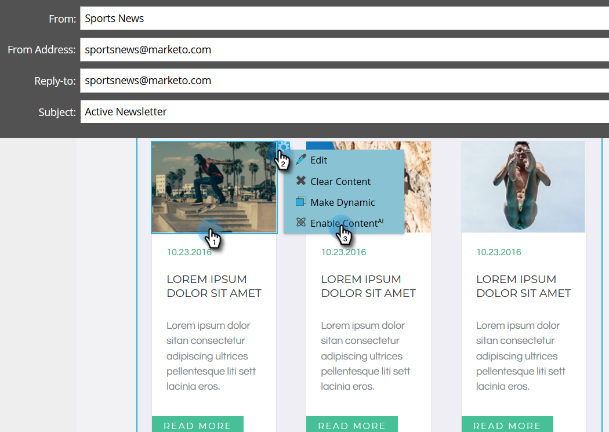

# 在電子郵件中啟用預測性內容 {#enable-predictive-content-in-emails}

為您的電子郵件中的一個或多個影像提供預測性，為每個收件者量身打造體驗。

>[!NOTE]
>
>建議您在測試和使用預測性內容之前，先為每個類別和每個來源（電子郵件、多媒體和長條）啟用超過五個內容。 更多內容可提供更好的預測性結果。

>[!PREREQUISITES]
>
>在啟用預測性內容之前，您必須：
>
>* **準備您的預測性內容**
>
>   * [編輯電子郵件的預測性內容](/help/marketo/product-docs/predictive-content/working-with-predictive-content/edit-predictive-content-for-emails.md){target="_blank"} 或
>   * [編輯多媒體預測性內容](/help/marketo/product-docs/predictive-content/working-with-predictive-content/edit-predictive-content-for-rich-media.md){target="_blank"} 或
>   * [編輯建議列的預測性內容](/help/marketo/product-docs/predictive-content/working-with-predictive-content/edit-predictive-content-for-the-recommendation-bar.md){target="_blank"}
>
>* [核准預測性內容的標題](/help/marketo/product-docs/predictive-content/working-with-all-content/approve-a-title-for-predictive-content.md){target="_blank"}

## 使用電子郵件2.0編輯器新增預測性內容 {#adding-predictive-content-using-the-email-editor}

1. 按一下 **行銷活動**.

   

1. 選取您的電子郵件並按一下 **編輯草稿**.

   

1. 按一下您要進行預測性的影像。 齒輪圖示出現時，按一下並選取 **啟用ContentAI** （ContentAI是預測性內容之前的名稱）。

   

1. 若要選取一或多個類別，請按一下 **類別** 下拉式清單，進行選取，然後按一下 **套用**.

   

   >[!NOTE]
   >
   >選擇特定類別或變更預測性版面配置是選擇性的。

1. 您的影像現在具有預測性。 如有需要，對其他影像重複步驟3和4。

   

1. 若要預覽電子郵件，請按一下 **預覽** 右上角。

   

1. 若要檢視不同的可能影像，請按一下 **重新整理**.

   

   >[!NOTE]
   >
   >未選取影像 **_直到收件者開啟電子郵件為止_**. 所以您在預覽中看到的只是一個範例，不一定是收件者看到的影像。

1. 預覽完電子郵件後，請按一下 **預覽動作** 下拉式清單並選取 **核准並關閉**. 或者，如果您仍然需要編輯，請按一下 **編輯草稿** 在右邊。

   

   >[!NOTE]
   >
   >傳送範例時，會選取隨機影像。

在您核准電子郵件後，電子郵件就會配備預測性內容，而且可以傳送！

>[!CAUTION]
>
>收件者開啟電子郵件後，預測性影像即遭鎖定。 如果稍後移除內容，收件者將會看到內容所在的損壞影像。

## 在不使用電子郵件2.0編輯器時新增預測性內容 {#adding-predictive-content-when-not-using-the-email-editor}

如果您未使用 [電子郵件2.0](/help/marketo/product-docs/email-marketing/general/email-editor-2/email-editor-v2-0-overview.md){target="_blank"} 範本，只需將範本中的影像標籤為Marketo可編輯的影像元素，即可將預測性內容新增至您的電子郵件。

瞭解 [此處為Marketo特定語法](/help/marketo/product-docs/email-marketing/general/email-editor-2/email-template-syntax.md#elements){target="_blank"}.

以下是程式碼應呈現的範例（這只是範例，請勿完全複製下列程式碼）。

**範例**

```example
<div class="mktoImg" id="exampleImg" mktoName="Example Image" mktoImgLink="https://www.marketo.com">  
<a></a>  
</div>
```
