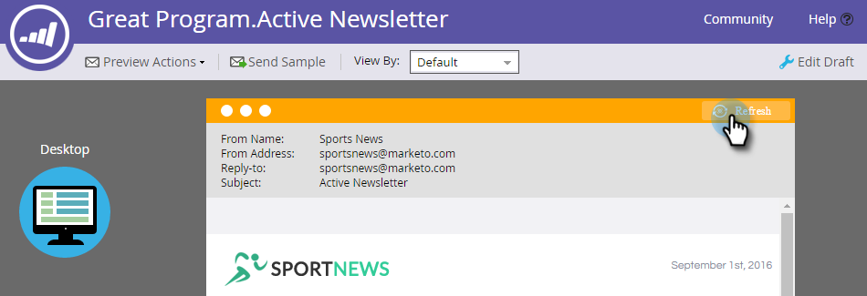

# 在電子郵件中啟用預測性內容 {#enable-predictive-content-in-emails}

讓電子郵件中的一或多張影像成為預測性，為每位收件者量身打造體驗。

>[!NOTE]
>
>建議您在測試和使用預測性內容之前，先針對每個類別和每個來源（電子郵件、豐富式媒體、橫條）啟用超過5個內容。 更多內容可讓您獲得更好的預測結果。

>[!PREREQUISITES]
>
>啟用預測性內容之前。 您必須：
>
>* [準備預測性內容](/help/marketo/product-docs/predictive-content/working-with-predictive-content/edit-predictive-content-for-emails.md)
>* [批准預測性內容的標題](/help/marketo/product-docs/predictive-content/working-with-all-content/approve-a-title-for-predictive-content.md)


## 使用Email 2.0編輯器新增預測性內容 {#adding-predictive-content-using-the-email-editor}

1. 按一下 **行銷活動**。

   

1. 選取您的電子郵件，然後按一下「 **編輯草稿**」。

   

1. 按一下您要預測的影像。 當齒輪圖示出現時，按一下它並選取「 **啟用內容`AI`**`AI` 」（「內容」是「預測性內容」的前一個名稱）。

   

1. 若要選取一或多個類別，請按一 **下「類別** 」下拉式清單，進行選取，然後按一下「 **套用」**。

   

   >[!NOTE]
   >
   >選擇特定類別或變更預測性版面是選擇性的。

1. 您的影像現在可預測。 對其他影像重複步驟3和4（如果需要）。

   

1. 若要預覽您的電子郵件，請 **按一下** 右上角的「預覽」。

   

1. 若要檢視不同的影像，請按一下「重新 **整理**」。

   

   >[!NOTE]
   >
   >在收件者開啟電子郵件 **_之前，不會選取影像_**。 所以，您在預覽中看到的只是一個範例，並不一定是收件者看到的影像。

1. 預覽完電子郵件後，按一下「預覽動 **作** 」下拉式清單，然後選 **取「核准並關閉」**。 或者，如果您仍需要編輯，請按一下右 **側的「編輯草稿** 」(Edit Draft)。

   

   >[!NOTE]
   >
   >傳送範例時，會選取隨機影像。

在您核准電子郵件後，它就會具備預測式內容並準備傳送！

>[!CAUTION]
>
>當收件者開啟電子郵件時，預測性影像便會鎖定。 如果稍後移除內容，收件者會看到內容所在的影像損毀。

## 不使用Email 2.0編輯器時新增預測性內容 {#adding-predictive-content-when-not-using-the-email-editor}

如果您不使用 [](/help/marketo/product-docs/email-marketing/general/email-editor-2/email-editor-v2-0-overview.md) Email 2.0範本，只要將範本中的影像標籤為Marketo可編輯的影像元素，即可將「預測性內容」新增至電子郵件。

在這裡瞭解 [Marketo特定語法](/help/marketo/product-docs/email-marketing/general/email-editor-2/email-template-syntax.md#elements)。

以下是程式碼應該顯示的範例（這只是範例，請勿精確複製下方的程式碼）。

**範例**

```example
<div class="mktoImg" id="exampleImg" mktoName="Example Image" mktoImgLink="http://www.marketo.com">  
<a></a>  
</div>
```
