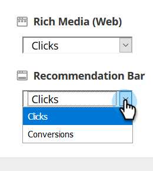

# 演算法目標設定{#algorithm-goal-settings}

演算法目標設定可讓您設定預測內容人工智慧演算法的最終目標，以符合您的業務目標。

1. 在「預測性內容」中，按一下您的登入名稱，然後選取「內容設定」**。**

   

1. 在「內容設定」下，選取「**演算法**」。

   

1. 為AI演算法的每個預測性內容來源選擇目標，以最大化您的內容效能。

   

   | **點按次數** | 顯示最可能讓檢視內容的人按下內容的內容 |
   |---|---|
   | **轉換** | 顯示最有可能讓檢視內容的人提交表單的內容 |

1. 完成時，按一下「保存」。****

   
