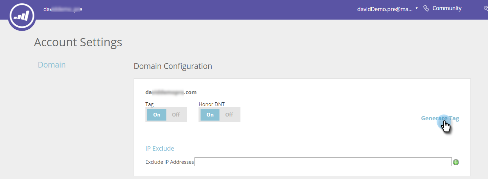

# 為Content-AI部署JavaScript {#deploy-the-javascript-for-content-ai}

若要使用預測內容，您需要產生並設定RTP（Web個人化）標籤。

## 產生標籤 {#generate-tag}

1. 登入預測內容帳戶。 前往 **帳戶設定**.

   

1. 在 **網域設定**，找到相關網域，然後按一下 **產生標籤**.

   

1. 複製Web個人化標籤並貼到網站的HTML中。

   

   >[!NOTE]
   >
   >複製Web個人化JavaScript標籤，並將其貼為頁面標題中的第一個指令碼，位於 `<head> </head>` 標籤。 查看更詳細的 [此處的實作指示](/help/marketo/product-docs/web-personalization/rtp-tag-implementation/deploy-the-rtp-javascript.md).

1. 確認標籤是否顯示在所有頁面上，包括登錄頁面和子網域。 在您網站的頁面上按一下滑鼠右鍵以檢查此項目。 前往 **檢視頁面來源** 在網頁瀏覽器中。 搜尋：&#39;RTP&#39;。

1. 確認「標籤」切換設為 **開啟**.
