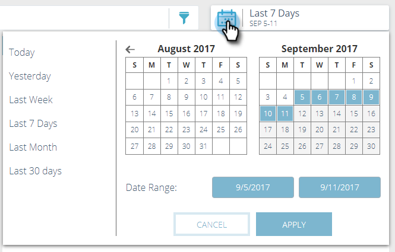
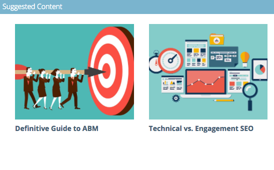

# 預測性內容分析概述 {#predictive-content-analytics-overview}

使用內容分析進一步深入瞭解您的現有內容、（根據AI和預測演演算法）瞭解哪些內容適合您的對象，並提高行銷工作的ROI。

>[!NOTE]
>
>Analytics標籤和內容分析功能僅適用於Marketo預測性內容。

## 概觀 {#overview}

在摘要頁面上，按一下 **Analytics**.

Analytics包含數個區段：依檢視排名最前的內容、依轉換率排名最前的內容、趨勢內容、建議內容和內容。

將滑鼠指標暫留在任何區段標題中的問號上，即可檢視詳細資訊。

按一下匯出按鈕，透過Excel匯出該區段的結果。

您可以依各種屬性/屬性來篩選結果（例如ABM帳戶清單、國家/地區等）。

按一下日曆圖示可變更反射資料的日期。 選擇預設的時間量或特定日期範圍。

## 依檢視排名最前的內容 {#top-content-by-views}

依所選日期範圍的檢視次數顯示排名最前的內容片段。

## 依轉換率排名最前的內容 {#top-content-by-conversion-rate}

顯示所選日期範圍依轉換率排名最前的轉換內容。

>[!NOTE]
>
>**定義**
>
>**轉換率**：直接轉換除以點按次數計算的百分比。

## 趨勢內容 {#trending-content}

檢視與去年同期相比過去兩週的檢視增加，顯示內容片段人氣激增。

## 建議內容 {#suggested-content}

顯示我們建議您根據您定義的篩選器，在行銷活動中促銷的內容。

將滑鼠指標暫留在「建議內容」中的影像上，即可顯示可用的選項。

>[!NOTE]
>
>看到底部的圖示了嗎？ 由左至右為：檢視內容、匯出至CSV、核准內容。

## 內容 {#content}

搜尋需要的內容片段，然後按一下以檢視其他詳細資料，包括：檢視該片段的訪客、新造訪與回訪的訪客、已知和匿名、訪客檢視內容時最常來自的位置，以及訪客推斷來自的行業。

>[!NOTE]
>
>類似內容是以選取的內容片段為基礎，並由關聯規則演演算法計算。 結果代表訪客最有可能點按的內容片段，實際情形取決於選取的片段和過去的訪客行為。 未將篩選器或日期範圍列入考量。
