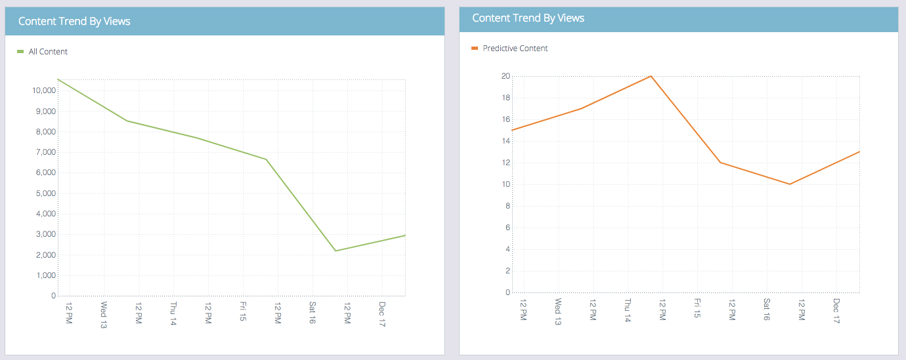

# 預測性內容摘要 {#the-predictive-content-summary}

「預測內容摘要」一覽就會顯示您所需的預測內容相關資訊，包含表格、圖形和目前數字。

## 頂端列 {#top-bar}

頂端列顯示內容和檢視的目前數目，以及已啟用的片段數量。 選取右上角整個頁面過去7或30天的檢視。

## 效能表 {#performance-table}

您可以在此處查看前10個已探索到的內容，包括檢視、直接銷售機會和轉換率。

## 預測性參與 {#predictive-engagement}

比較點按總次數和直接銷售機會，並比較不同來源的效能，以了解您的轉換率。

## 依檢視的內容趨勢  {#content-trend-by-views}

比較所有內容的檢視與預測內容的相符程度。

## 依參與排名最前的類別 {#top-categories-by-engagement}

哪些內容類別最吸引人？ 在此圖表中查看。

>[!NOTE]
>
>如果您按一下類別連結(上圖中的範例：利德根、電子郵件等。) 它會開啟「所有內容」頁面，您點按的類別已新增至篩選器，並顯示該類別中的內容分析。
