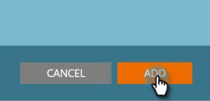

# 新增內容 {#add-new-content}

>[!NOTE]
>
>根據購買日期，您的Marketo訂閱可能包含Marketo預測性內容或內容`AI`。 對於使用「預測性內容」的使用者，Marketo會在2018年4月`AI` 30日之前啟用「內容分析」功能。 若要將這些功能保留在該日期之後，請連絡您的Marketo Customer Success Manager以升級至Marketo Content`AI`。

您可以輕鬆將內容手動新增至「所有內容」頁面。

1. 按一下「 **新增內容** 」下拉式清單，然後選 **取「新增內容」**。

   

1. 輸入標題和URL，以及影像URL（如果您需要）。

   

1. 若要新增類別，請按一下欄位並從下拉式清單中選取。

   

1. 按一 **下新增**。

   

1. 新標題現在會顯示在「所有內 **容」頁面** 。 請注意，它尚未針對預測性內容核准。

   

1. 以下說明如何將它新增至預測 [性內容](http://docs.marketo.com/x/Vbet)。

