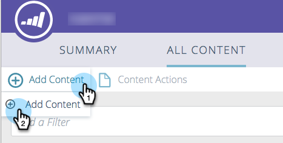

# 新增內容 {#add-new-content}

您可以輕鬆地手動新增內容至[!UICONTROL All Content]頁面。

1. 按一下&#x200B;**[!UICONTROL Add Content]**&#x200B;下拉式清單，然後選取&#x200B;**[!UICONTROL Add Content]**。

   

1. 輸入標題和URL，如果需要的話輸入影像URL。

   

1. 若要新增類別，請按一下欄位，然後從下拉式清單中選取。

   

1. 按一下「**[!UICONTROL Add]**」。

   

1. 新標題現在會顯示在&#x200B;**[!UICONTROL All Content]**&#x200B;頁面上。 請注意，尚未核准預測性內容。

   

1. 以下說明如何將其新增至[預測性內容](/help/marketo/product-docs/predictive-content/working-with-all-content/approve-a-title-for-predictive-content.md)。
