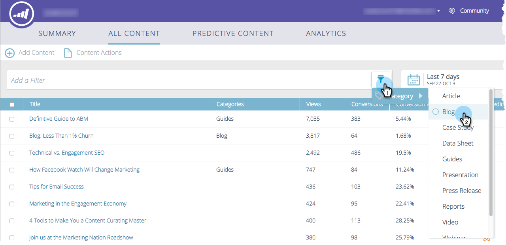

# 瞭解所有內容{#understanding-all-content}

「所有內容」頁面會顯示已手動搜尋或新增的所有內容。

頁面欄位包括：

* **標題**:內容片段的名稱
* **類別**:由您建立，用於將網路或電子郵件的預測結果分組
* **檢視**:發現的網頁內容（包括所有來源）的點按總數
* **轉換**:在同一次瀏覽中檢視內容片段並完成表單的訪客數
* **轉換率**:百分比，由直接轉換除以點按計算
* **批准預測**:圖示會在內容獲核準時顯示

您可以新增內容並加以追蹤、移除內容或核准內容。 在核准內容後，您可在「預測性內容」頁面上加以編輯。

## 依類別篩選內容{#filter-content-by-categories}

選取一或多個類別以篩選內容。 然後，使用標準或自訂設定，設定內容分析的日期或日期範圍。

1. 在&#x200B;**所有內容**&#x200B;頁面上，按一下篩選圖示，然後在&#x200B;**類別**&#x200B;下，選取一或多個內容類別。

   

1. 現在，只會顯示該類別的內容。

   

## 顯示日期或日期範圍{#display-analytics-for-a-date-or-date-range}的Analytics

1. 若要顯示特定日期或日期範圍的資料，請按一下日曆圖示，然後從左側面板中選取。 對於自訂日期範圍，請按一下日曆上日期範圍的第一天和最後一天（如所示）。 按一下&#x200B;**Apply**。

   

1. 現在，會針對所選日期範圍內的內容顯示分析。

>[!MORELIKETHIS]
>
>* [新增內容](/help/marketo/product-docs/predictive-content/working-with-all-content/add-new-content.md)
>* [刪除內容](/help/marketo/product-docs/predictive-content/working-with-all-content/delete-content.md)
>* [批准預測性內容的標題](/help/marketo/product-docs/predictive-content/working-with-all-content/approve-a-title-for-predictive-content.md)
>* [取消核准預測性內容的標題](/help/marketo/product-docs/predictive-content/working-with-all-content/unapprove-a-title-for-predictive-content.md)

