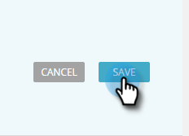

# 編輯多媒體預測性內容 {#edit-predictive-content-for-rich-media}

以下說明如何設定Rich Media的預測性內容。

>[!PREREQUISITES]
>
>內容必須是 [已核准預測性內容](/help/marketo/product-docs/predictive-content/working-with-all-content/approve-a-title-for-predictive-content.md) （在所有內容頁面上）。

1. 於 **預測性內容** 頁面上，按一下標題以開啟編輯器。

   

1. 按一下 **多媒體**.

   

1. 您會注意到，電子郵件和多媒體可以有不同的影像。 若要新增/變更影像，請將影像URL貼到其文字方塊中。

   

1. 輸入 **說明**.

   

1. 按一下 **類別** 方塊以選取/新增 [您已設定的類別](/help/marketo/product-docs/predictive-content/getting-started/set-up-categories.md) （選擇性）。

   

   >[!NOTE]
   >
   >使用類別將特定多媒體推薦範本的內容分組。 將類別保留空白可套用內容至所有建議範本（建議）。
   >
   >不過，如果您只想為多媒體範本建議特定內容，請為內容新增類別，並將該類別與建議範本建立關聯。
   >
   >例如，根據您網站的區段（產品或解決方案）來分類相關內容。

1. 核取方塊以啟用Rich Media的預測性內容。

   

1. 按一下 **儲存**.

   
