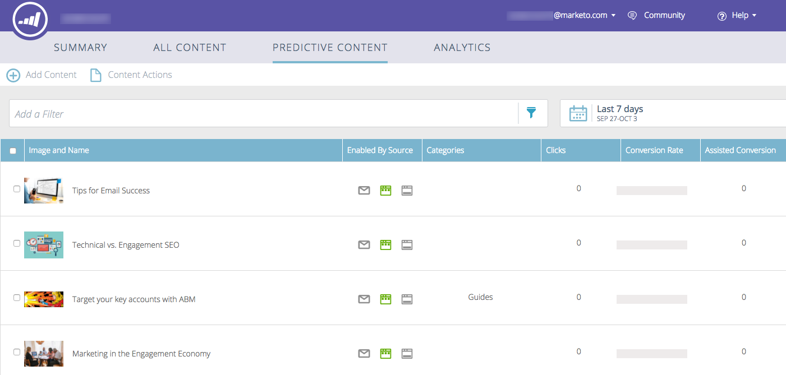

# 瞭解預測性內容{#understanding-predictive-content}

在[核准預測性內容的標題](/help/marketo/product-docs/predictive-content/working-with-all-content/approve-a-title-for-predictive-content.md)後，您就可在此處處理它。 「預測性內容」頁面會顯示您已針對預測性內容核准的所有標題。

頁面欄位包括：

* **影像和標題**:內容片段的名稱和選取的影像
* **源啟用**:顯示標題是否已核准至Rich Media、電子郵件或建議列。
* **類別**:由您建立，用於將網路或電子郵件的預測結果分組
* **點按**:建議內容（包括所有來源）的點按總數
* **轉換率**:直接轉換除以點按計算的百分比。將滑鼠指標暫留以檢視其他資料（請參閱下方）
* **輔助轉換**:在過去瀏覽中點選建議內容並稍後完成表單的訪客

## 篩選內容{#filtering-content}

**類別**

您可以依您建立的類別篩選內容。 按一下篩選圖示，然後在&#x200B;**Category**&#x200B;下，選取一或多個內容類別。

**啟用源**

依每種啟用的內容類型進行篩選：電子郵件、豐富式媒體、建議列。

**依來源分析**

篩選已啟用的內容分析可讓您查看每個來源的執行情形。

## 依日期顯示分析{#display-analytics-by-date}

1. 選擇右側的開始和結束日期（如所示）。 按一下&#x200B;**Apply**。

   

## 檢視預測性內容的表格資料{#view-table-data-for-predictive-content}

在表格中，您可以從左至右檢視哪些來源已啟用預測性內容：建議列、電子郵件和多媒體。 啟用的來源以綠色顯示。 您可在編輯內容時啟用這些功能。

將滑鼠指標暫留在「轉換率」欄的列上，以檢視轉換率、直接轉換和點按的資料。

>[!NOTE]
>
>**定義**
>
>**轉換率**:百分比，由直接轉換除以點按計算
>
>**直接轉換**:在同次瀏覽中點選建議內容並完成表單的訪客
>
>**已點按**:建議內容的點按總次數（包括所有三個來源）
