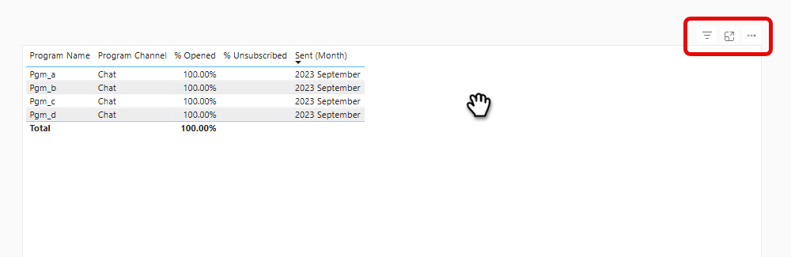

# 進階 BI 分析概觀 {#advanced-bi-analytics-overview}

Advanced BI Analytics (先前稱為Revenue Explorer和Advanced Report Builder)提供Marketo Engage資料的靈活報表和視覺化介面，提供關於進度、效能等專案的詳細資訊。 它提供更豐富的互動性和視覺效果、更快的效能，以及更順暢且直覺的使用者體驗。

這些增強功能可協助您節省時間、發掘更多有價值的深入分析、推動最佳化，並與同事和利害關係人分享更吸引人的資料故事。

>[!PREREQUISITES]
>
>若要存取此功能，您必須已購買進階BI Analytics附加元件。 如需詳細資訊，請聯絡Adobe客戶團隊（您的客戶經理）。

## 主要功能與優點 {#key-features-and-benefits}

* **高效能查詢引擎**：在大型資料集上提供5倍的效能，讓資料處理更快速、報告載入更快，以及分析體驗更順暢。

* **豐富且吸引人的視覺效果**：包含圖表、地圖及KPI指標在內建的視覺效果選項集合大幅擴充，讓儀表板更具深入解析度及影響力，並大幅提升資料敘事能力。

* **進階互動與動態篩選**：套用跨視覺效果的動態交叉篩選器和相依篩選器。 多頁報表支援進階的向下切入、向上切入和鑽研，確保資料探索毫不費力。

* **直覺式報表製作介面**：點選式體驗可簡化報表建立作業，包括多頁鑽研報表。 此介面可讓使用者設計複雜的互動式報表，而不需要深入的技術專業知識。

* **輕鬆共用，包括PowerPoint匯出**：內建的共用功能可讓您輕鬆共用深入分析。 除了其他目的地以外，使用者可以輕鬆產生適合簡報的PowerPoint投影片。

## 建立報告 {#create-a-report}

1. 在「我的Marketo」中，按一下「**[!UICONTROL Advanced BI Analytics]**」圖磚。

   {width="800" zoomable="yes"}

1. 在&#x200B;**[!UICONTROL Reports]**&#x200B;索引標籤中，按一下&#x200B;**[!UICONTROL Create Report]**。

   {width="800" zoomable="yes"}

1. 選取所需的量值。

   {width="800" zoomable="yes"}

1. 選取所需的尺寸。

   {width="800" zoomable="yes"}

1. 選擇您偏好的視覺效果。

   {width="800" zoomable="yes"}

1. 拖放維度屬性以新增篩選器。

   {width="800" zoomable="yes"}

## 匯出報告 {#export-a-report}

匯出完整報表時，您的匯出選項為PDF和PPT。 如果您需要.XLS或.CSV格式的資料，可透過匯出個別視覺效果（[請參閱以下的](#export-a-visualization)）來完成。

>[!BEGINTABS]

>從報告頁面[!TAB ]

1. 在「報表」頁面上，按一下所需報表的「更多」圖示(...)，然後選取&#x200B;**匯出**。

   

1. 選擇PDF或PPT，然後按一下&#x200B;**匯出**。

   

>[!TAB 在報表中]

1. 在報表內，按一下右上角的「更多」圖示(**...**)，然後選取&#x200B;**匯出**。

   

1. 選擇PDF或PPT，然後按一下&#x200B;**匯出**。

   

>[!ENDTABS]

### 匯出視覺效果 {#export-a-visualization}

瞭解如何匯出報表的特定區段。

1. 選擇所需的報表。

   {width="600" zoomable="yes"}

1. 將滑鼠停留在顯示的視覺效果上以顯示三個圖示。

   {width="600" zoomable="yes"}

1. 按一下「更多」圖示(**...**)

   

1. 選取&#x200B;**匯出資料**。

   

1. 選擇您需要的資料格式。

   

   >[!NOTE]
   >
   >* _目前配置為_&#x200B;的資料僅適用於表格與矩陣視覺效果。
   >* _在Marketo Engage中無法使用_&#x200B;基礎資料。

1. 選擇所需的檔案格式(.XLS、.CSV)。

   

1. 按一下&#x200B;**匯出**。

## 影片示範 {#video}

觀看以下影片，瞭解多頁面、鑽研報表體驗的範例。

>[!VIDEO](https://video.tv.adobe.com/v/3451681/?quality=12&learn=on){transcript=true}

## 進階BI Analytics中的標準報表 {#standard-reports}

下列標準報表可作為自訂報表的範例納入。

<table>
  <thead>
    <tr>
      <th>報告區域</th>
      <th>報告名稱</th>
    </tr>
  </thead>
  <tbody>
    <tr>
      <td rowspan="8">電子郵件分析</td>
      <td>電子郵件 — 已傳送活動(CST)</td>
    </tr>
    <tr>
      <td>電子郵件 — 點選活動(CST)</td>
    </tr>
    <tr>
      <td>電子郵件 — 開啟活動(CST)</td>
    </tr>
    <tr>
      <td>電子郵件 — 點選時間分佈(CST)</td>
    </tr>
    <tr>
      <td>電子郵件 — 開啟率衰減</td>
    </tr>
    <tr>
      <td>電子郵件 — 開啟時間分佈(CST)</td>
    </tr>
    <tr>
      <td>電子郵件 — 效能詳細資料</td>
    </tr>
    <tr>
      <td>電子郵件 — 點按率衰減</td>
    </tr>
    <tr>
      <td rowspan="8">潛在客戶分析</td>
      <td>前10個銷售機會來源（依轉換的銷售機會）</td>
    </tr>
    <tr>
      <td>前10個銷售機會來源</td>
    </tr>
    <tr>
      <td>SLA違規報表</td>
    </tr>
    <tr>
      <td>潛在客戶帳齡報表</td>
    </tr>
    <tr>
      <td>潛在客戶餘額報表</td>
    </tr>
    <tr>
      <td>潛在客戶轉換報表</td>
    </tr>
    <tr>
      <td>潛在客戶流量報表</td>
    </tr>
    <tr>
      <td>前置過渡時間報表</td>
    </tr>
    <tr>
      <td rowspan="5">方案分析</td>
      <td>依成功排名的10大計畫</td>
    </tr>
    <tr>
      <td>總管道排名前10位的計畫</td>
    </tr>
    <tr>
      <td>方案收入階段報表</td>
    </tr>
    <tr>
      <td>前10名贏取計畫</td>
    </tr>
    <tr>
      <td>行銷管道投資趨勢</td>
    </tr>
    <tr>
      <td rowspan="7">機會分析</td>
      <td>對已關閉商機的行銷影響</td>
    </tr>
    <tr>
      <td>對已結束成功的機會的行銷影響</td>
    </tr>
    <tr>
      <td>行銷對所建立機會的影響</td>
    </tr>
    <tr>
      <td>(FT)行銷對所創造商機的影響</td>
    </tr>
    <tr>
      <td>(MT)對已結束成功的機會的行銷影響</td>
    </tr>
    <tr>
      <td>(MT)行銷對所創造商機的影響</td>
    </tr>
    <tr>
      <td>(FT)對已結束成功的商機的行銷影響</td>
    </tr>
    <tr>
      <td>商機潛在客戶分析</td>
      <td>前10名潛在客戶擁有者（依成功的商機）</td>
    </tr>
  </tbody>
</table>

## 注意事項 {#note}

* 您的自訂報告已從傳統體驗復寫到新的體驗，其中包含下面[學習新體驗](#learning-the-new-experience)一節中提到的重大行為變更。

* 傳統體驗中的儀表板無法傳輸，因此必須在新體驗中進行重新建立。 它們可以重新建立為新體驗中的報表，而新體驗中的篩選器會自動提取可能的值。

  >[!NOTE]
  >
  >新體驗中的儀表板只是單一頁面上的報告集合。 新體驗中儀表板的主要價值，是允許您針對不同的報告區域提供分析見解。

* 您可以在Advanced BI Analytics中建立最多&#x200B;**個**&#x200B;報表。

  >[!NOTE]
  >
  >如果您在Revenue Explorer中有超過700個報表，部分報表已與其他報表合併，並透過報表中的頁面合併。
  >
  >* 如果報表具有電子郵件訂閱，則不會合併。
  >
  >* _相同資料夾_&#x200B;中的其餘報告已依報告區域合併為一或多個報告。 如果報告區域有超過五份報告，則合併為一個以上的合併報告。
  >
  >* 每個合併報表不超過5頁。

* 任何特定視覺效果的每個查詢有100萬列的限制。 如果查詢超過此限制，您將收到下列錯誤： `The resultset of a query to external data source has exceeded the maximum allowed size of '1000000' rows`。 若要修正此問題，請縮小日期範圍，和/或調整報表中的篩選器，以減少查詢結果中的列數。

## 瞭解新體驗 {#learning-the-new-experience}

新的視覺效果體驗是透過內嵌Power BI服務提供。

如需視覺效果體驗的快速教學課程，請造訪Microsoft的[在Power BI中使用視覺效果](https://learn.microsoft.com/en-us/training/modules/visuals-in-power-bi/){target="_blank"}檔案。 請注意，您可能不會在Marketo Engage中看到所有這些功能。

### 重大體驗變更 {#notable-experience-changes}

以下是傳統體驗(收入總管/進階Report Builder)的新體驗（進階BI Analytics）變更。

* 日期型別篩選器的功能相同；但是，指定值的語法已變更。 在現有自訂報表中，除「星期」外的所有日期型別篩選值，都會自動轉換為新體驗中對應的同等值。 已停止支援「星期」值。

* 字串型別篩選器現在區分大小寫。

* 電子郵件訂閱包括PDF匯出，而非報表的HTML。 新的電子郵件訂閱不包括報告定義。

* 目前不支援報表的深層連結。

>[!NOTE]
>
>在模型效能分析（銷售機會）的視覺化報告區域中，不能包含超過一個自訂欄位群組欄位。

>[!MORELIKETHIS]
>
>[度量和維度](/help/marketo/product-docs/reporting/advanced-bi-analytics/metrics-and-dimensions.md){target="_blank"}
