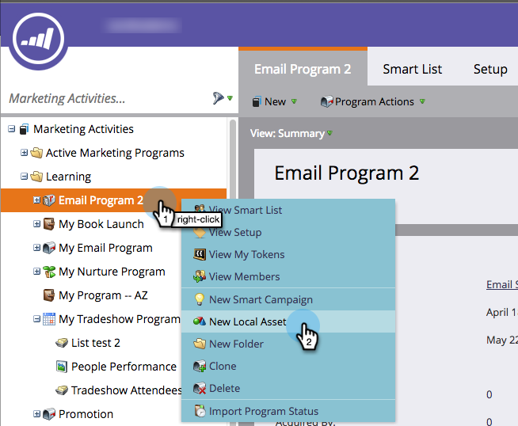

# 在程式{#create-a-report-in-a-program}中建立報告

執行報告以分析人員、您的程式、登陸頁面、電子郵件和社交資產。

1. 前往&#x200B;**行銷活動**。

   

1. 選擇一個程式。

   

   >[!NOTE]
   >
   >您也可以從&#x200B;**Analytics**&#x200B;標籤建立報表。

1. 按一下右鍵程式，然後選擇&#x200B;**新建本地資產**。

   

1. 按一下「**報表**」。

   

1. 選擇報表&#x200B;**類型**。

   

   >[!TIP]
   >
   >如需每個報表的簡短說明，請參閱[報表類型概述](https://docs.marketo.com/display/DOCS/Report+Type+Overview)。

1. 為報表命名。

   

   >[!TIP]
   >
   >若要讓日後導覽報表更輕鬆，請在名稱中加入報表類型的參考。

1. 設定報表的時間範圍。 如需詳細資訊，請參閱[變更報表時間範圍](/help/marketo/product-docs/reporting/basic-reporting/editing-reports/change-a-report-time-frame.md)。

1. 按一下&#x200B;**報表**&#x200B;標籤以查看您的統計資料。

   

   >[!NOTE]
   >
   >依預設，報表會涵蓋您帳戶中所有程式的活動。

   >[!NOTE]
   >
   >您最後可以很快得到許多報告。 請記得[刪除您不再需要的報表](/help/marketo/product-docs/reporting/basic-reporting/report-activity/delete-a-report.md)。

   >[!MORELIKETHIS]
   >
   >您可以[變更報表時間範圍](/help/marketo/product-docs/reporting/basic-reporting/editing-reports/change-a-report-time-frame.md)、[訂閱基本報表](/help/marketo/product-docs/reporting/basic-reporting/report-subscriptions/subscribe-to-a-basic-report.md)、[將報表匯出至Excel](/help/marketo/product-docs/reporting/basic-reporting/report-activity/export-a-report-to-excel.md)、[以智慧清單](/help/marketo/product-docs/reporting/basic-reporting/editing-reports/filter-people-in-a-report-with-a-smart-list.md)篩選報表中的人員等。
