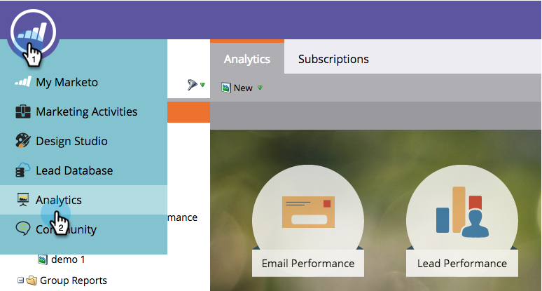

# 瀏覽Analytics首頁 {#navigating-the-analytics-home-page}

1. 前往 **分析** 區域。

1. 

1. 選取 [報告型別](/help/marketo/product-docs/reporting/basic-reporting/report-types/report-type-overview.md).

1. 

1. 執行報告後，按一下工作區以返回 **Analytics首頁**.

   

   太棒了！ 您知道如何瀏覽Analytics首頁！

>[!MORELIKETHIS]
>
>[瞭解我的報表和群組報表](/help/marketo/product-docs/reporting/basic-reporting/creating-reports/understanding-my-reports-and-group-reports.md)
