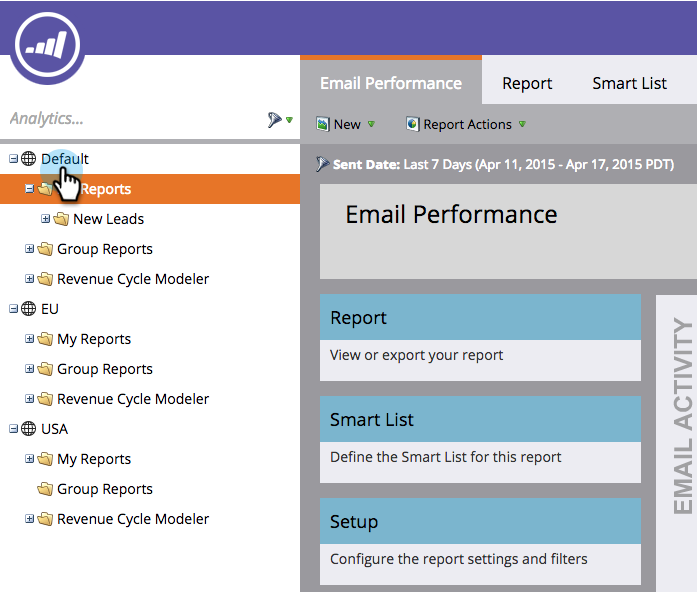

# 導覽Analytics首頁 {#navigating-the-analytics-home-page}

1. 前往「分 **析** 」區。
1. 

1. 選擇報 [表類型](../../../../product-docs/reporting/basic-reporting/report-types/report-type-overview.md)。
1. 

1. 執行報表後，按一下工作區以返回 **Analytics首頁**。

   

   太好了！ 您知道如何瀏覽Analytics首頁！

>[!MORELIKETHIS]
>
>[瞭解我的報表和群組報表](understanding-my-reports-and-group-reports.md)

