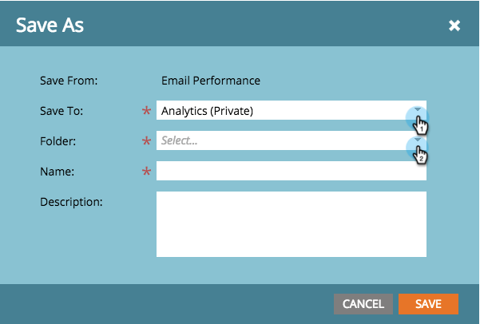

# 儲存報表 {#save-a-report}

有時，您可能需要儲存預設報表，以便稍後再檢視。 您可以透過下列方式：

1. 前往「分 **析** 」區。
1. 

1. 選擇報 [表類型](../../../../product-docs/reporting/basic-reporting/report-types/report-type-overview.md)。

   

1. 按一下「**報表動作**」並選取「另 **存新檔」**。

   

1. **保存到位置** ，然後選擇一個 **資料夾**。

   

1. **命名報表** ，然後按一下「 **儲存**」。

   

   酷！ 您儲存的報表現在會顯示在樹狀結構中。

   

>[!MORELIKETHIS]
>
>瞭解如何 [將報表複製至群組報表](../../../../product-docs/reporting/basic-reporting/report-activity/clone-a-report-to-group-reports.md)。

