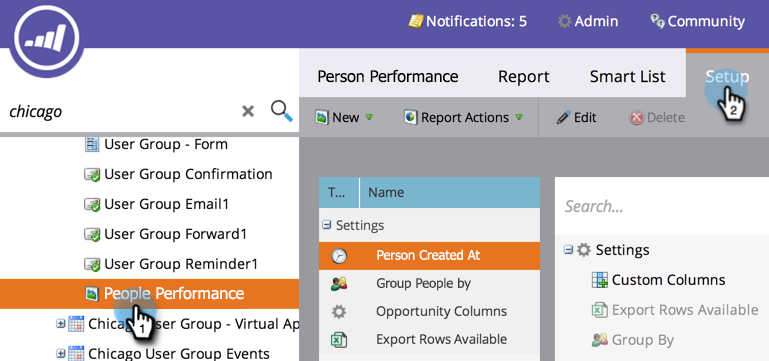

# 新增自訂欄至人員報表{#add-custom-columns-to-a-person-report}

您可以使用[智慧型清單](/help/marketo/product-docs/core-marketo-concepts/smart-lists-and-static-lists/understanding-smart-lists.md)做為自訂欄，進一步篩選人員報表中的量度。

1. 前往「行銷活動」區域（或&#x200B;**Analytics**）。****

   

1. 選擇您的報表，然後按一下&#x200B;**Setup**&#x200B;標籤。

   

1. 拖曳至&#x200B;**自訂欄**。

   

1. 選擇要用作報告列的智慧清單。

   

1. 你做到了！ 按一下&#x200B;**報表**&#x200B;標籤，查看您的報表及新欄。

   

   >[!MORELIKETHIS]
   >
   >您也可以[將業務機會列添加到銷售線索報表](/help/marketo/product-docs/reporting/basic-reporting/editing-reports/add-opportunity-columns-to-a-lead-report.md)。
