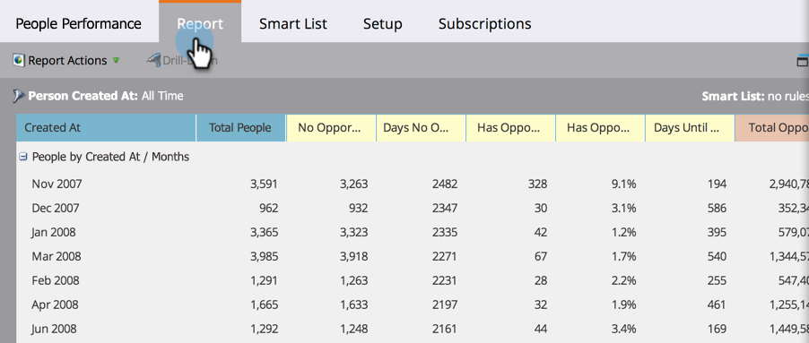

# 將業務機會列添加到銷售線索報表{#add-opportunity-columns-to-a-lead-report}

要查看[person報告](https://docs.marketo.com/display/docs/basic+reporting)中有關業務機會的統計資訊，您可以添加業務機會列。

1. 前往&#x200B;**行銷活動**&#x200B;區域。

   

1. 從導航樹中選擇您的報告，然後按一下&#x200B;**Setup**&#x200B;頁籤。

   

1. 按兩下&#x200B;**Opportunity Columns**。

   

1. 從下拉菜單中選擇&#x200B;**顯示**。

   

1. 按一下&#x200B;**Report**&#x200B;頁籤，查看包含機會度量的報表。

   

   >[!TIP]
   >
   >向右捲動以檢視更多欄。

1. 要從報表](select-report-columns.md)中添加或刪除列，請按一下任何列標題並選擇&#x200B;**列**。[

   

   可用的業務機會列包括：

   >[!NOTE]
   >
   >根據分配給每個機會的主要聯繫人，每個機會只被計算一次。

   | 欄 | 說明 |
   |---|---|
   | 無機會 | *不是*&#x200B;主要機會聯繫人的人數。 |
   | 無機會天數 | *並非*&#x200B;主要聯絡人的平均年齡（以天為單位）。 |
   | 有機會 | 作為主要機會聯繫人的人數。 |
   | 有機會% | 作為主要機會聯繫人的百分比。 |
   | 銷售機會的間隔天數 | 從人員到主要業務機會聯繫人的平均轉換天數。 |
   | 總機會金額 | 所有機會金額的總和。 |
   | 平均業務機會金額 | 業務機會金額總和，除以業務機會數。 |
   | 總機會 | 所有機會的數量。 |
   | 已關閉 | 已關閉、贏得或失去的機會數。 |
   | Won | 已贏得的機會數。 |
   | %韓元 | 已贏得的機會百分比。 |
   | 韓元總額 | 已獲得的機會金額總和。 |
   | 關閉天數 | 關閉機會的平均天數。 |
   | 銷售天數 | 銷售週期的平均長度(Days Entil Opportunity + Days to Close)。 |

   >[!MORELIKETHIS]
   >
   >
   >
   >瞭解如何[管理報表的大小](configure-report-size.md)。

   >[!NOTE]
   >
   >**深入探討**
   >
   >
   >在[基本報表](https://docs.marketo.com/display/docs/basic+reporting)深入探討中，瞭解您還可以如何處理報表。

