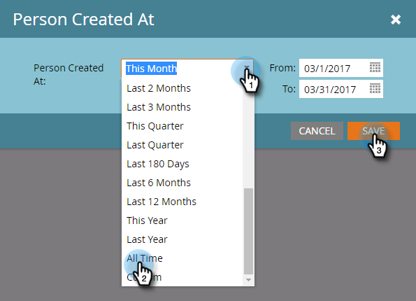

# 變更報表時間範圍 {#change-a-report-time-frame}

變更報告所涵蓋的時段，以專注於活動的特定時間。

1. 前往 **行銷活動** (或 **Analytics**)區域。

   

1. 從導覽樹狀結構中選取報表，然後按一下 **設定** 標籤。

   

1. 連按兩下時間範圍欄位，其標籤會依報告型別而有所不同：

   * **個人建立時間**，親筆報告
   * **傳送日期**，在電子郵件報表中
   * **活動日期**，在所有其他報表中

   

   >[!NOTE]
   >
   >**個人建立時間** 是指在您的資料庫中認識此人的時間。

1. 從下拉式選單中選擇適當的時間範圍。

   

   >[!TIP]
   >
   >若要設定特定日期，請選取 **自訂** 從下拉式功能表，並在 **從** 和 **至** 行事曆欄位。

   按一下 **報告** 標籤以檢視所選時間範圍內的報表。\
   

   >[!MORELIKETHIS]
   >
   >若要依特定人員屬性縮小報表範圍，您可以 [使用智慧清單篩選報表中的人員](/help/marketo/product-docs/reporting/basic-reporting/editing-reports/filter-people-in-a-report-with-a-smart-list.md).
