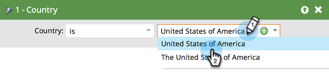

# 使用智慧清單篩選報告中的人員 {#filter-people-in-a-report-with-a-smart-list}

使用智慧列示，依特定人員屬性篩選報表。

您可以將智慧列示用於下列報表型別：

* [人員績效](/help/marketo/product-docs/reporting/basic-reporting/report-types/people-performance-report.md)
* [依狀態區分的人員](/help/marketo/product-docs/reporting/basic-reporting/report-types/people-by-status-report.md)
* [電子郵件效能](/help/marketo/product-docs/email-marketing/email-programs/email-program-data/email-performance-report.md)
* [電子郵件連結效能](/help/marketo/product-docs/email-marketing/email-programs/email-program-data/email-link-performance-report.md)
* [參與資料流績效](/help/marketo/product-docs/email-marketing/drip-nurturing/reports-and-notifications/engagement-stream-performance-report.md)
* [行銷活動電子郵件績效](/help/marketo/product-docs/reporting/basic-reporting/report-types/campaign-email-performance-report.md)
* [公司網頁活動](/help/marketo/product-docs/reporting/basic-reporting/report-types/company-web-activity-report.md)
* [網頁活動](/help/marketo/product-docs/reporting/basic-reporting/report-types/web-page-activity-report.md)

1. 前往「**[!UICONTROL Marketing Activities]**」區域。

   

1. 從導覽樹狀結構選取您的報告，然後按一下&#x200B;**[!UICONTROL Smart List]**&#x200B;標籤。

   

1. 找到合適的篩選器，然後將其拖曳過去。

   

1. 設定篩選器。

   

1. 按一下「**[!UICONTROL Report]**」索引標籤以檢視篩選的報告。

   

   太棒了！ 現在，您的報表只會顯示符合智慧清單之人員的資料。
