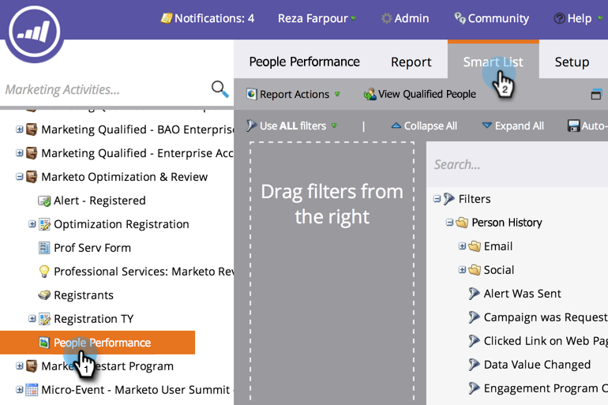

# 使用智慧型清單篩選報表中的人員 {#filter-people-in-a-report-with-a-smart-list}

使用智慧型清單，依特定人員屬性來篩選報表。

>[!NOTE]
>
>**FYI**
>
>Marketo現在正在標準化所有訂閱的語言，因此您可能會在您的訂閱中看到潛在客戶／潛在客戶，並在docs.marketo.com中看到個人／人員。 這些術語意義相同；它不會影響文章指示。 還有一些其他變化。 [進一步瞭解](http://docs.marketo.com/display/DOCS/Updates+to+Marketo+Terminology)。

您可以將智慧型清單與下列報表類型搭配使用：

* [人員績效](../../../../product-docs/reporting/basic-reporting/report-types/people-performance-report.md)
* [各狀態人物](../../../../product-docs/reporting/basic-reporting/report-types/people-by-status-report.md)
* [依收入階段劃分的人員](http://docs.marketo.com/display/DOCS/People+by+Revenue+Stage+Report)
* [電子郵件效能](../../../../product-docs/email-marketing/email-programs/email-program-data/email-performance-report.md)
* [電子郵件連結效能](../../../../product-docs/email-marketing/email-programs/email-program-data/email-link-performance-report.md)
* [參與流效能](../../../../product-docs/email-marketing/drip-nurturing/reports-and-notifications/engagement-stream-performance-report.md)
* [促銷活動活動](../../../../product-docs/reporting/basic-reporting/report-types/campaign-activity-report.md)
* [促銷活動電子郵件績效](../../../../product-docs/reporting/basic-reporting/report-types/campaign-email-performance-report.md)
* [公司網路活動](../../../../product-docs/reporting/basic-reporting/report-types/company-web-activity-report.md)
* [網頁活動](../../../../product-docs/reporting/basic-reporting/report-types/web-page-activity-report.md)

1. 前往「行銷 **活動** 」區。

   

1. 從導覽樹中選擇您的報表，然後按一下「智 **慧型清單** 」標籤。

   

1. 尋找適當的篩選，並拖曳至上方。

   

1. 設定篩選。

   

1. 按一下「 **報表** 」標籤，查看您的篩選報表。

   

   太好了！ 現在，您的報表只會顯示符合智慧型清單的人員的資料。

   >[!NOTE]
   >
   >**深入探討**
   >
   >
   >如需使用報表的更多方法，請參閱「基 [本報表](http://docs.marketo.com/display/docs/basic+reporting) 」深入探討。

