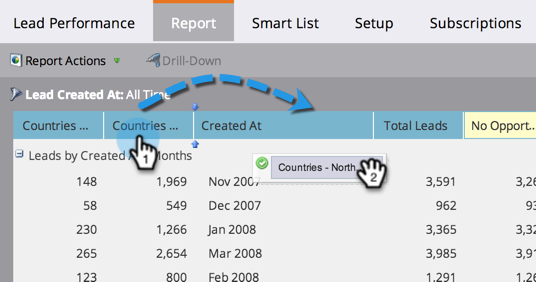

# 重新排序報表欄 {#reorder-report-columns}

您可以變更報表中欄的順序。

1. 前往 **行銷活動** (或 **分析**)區域。

   

1. 從導覽樹狀結構中選取報表，然後按一下 **報告** 標籤。

   

1. 按住該欄，將其拖曳至新位置，然後放開滑鼠按鈕。

   

1. 完成了！ 欄現在會以新順序顯示。

   

   您可以重複這些步驟，直到欄以最適合您的順序出現。

   >[!MORELIKETHIS]
   >
   >[選取報表欄](/help/marketo/product-docs/reporting/basic-reporting/editing-reports/select-report-columns.md)
