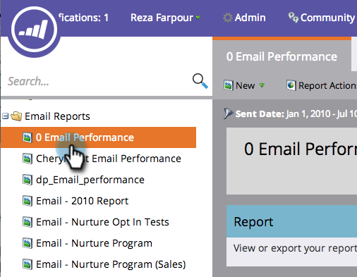

# 選取報表欄 {#select-report-columns}

您可以選擇報表中包含和未包含的欄。

1. 前往 **Analytics** (或 **行銷活動**)區域。

   

1. 選取您的報表。

   

1. 按一下 **報表** 標籤，然後按一下任何欄標題並選取 **欄**，然後選擇要包含的欄。

   

   >[!MORELIKETHIS]
   >
   >[按列排序報表](/help/marketo/product-docs/reporting/basic-reporting/editing-reports/sort-report-on-columns.md)
