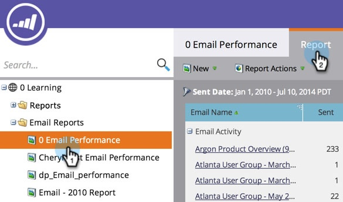

# 根據欄排序報告 {#sort-report-on-columns}

使用欄來排序報表中的資料，並讓最重要的數字容易找到。

1. 移至&#x200B;**[!UICONTROL Analytics]** （或&#x200B;**[!UICONTROL Marketing Activities]**）。

   

1. 從導覽樹狀結構中選取您的報表，然後按一下「**[!UICONTROL Report]**」標籤。

   

1. 按一下最重要的欄並選取排序順序。

   

1. 太棒了！ 現在您可以專注於報表中最有趣的資料。

   

   >[!MORELIKETHIS]
   >
   >[選取報告資料行](/help/marketo/product-docs/reporting/basic-reporting/editing-reports/select-report-columns.md)
