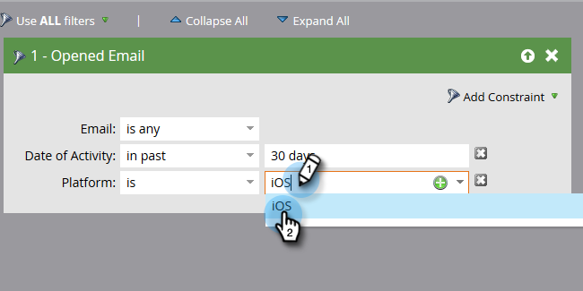
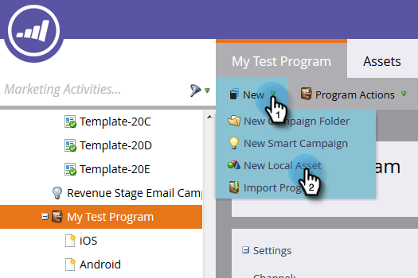

# 使用行動平台欄建立人員績效報表 {#build-a-people-performance-report-with-mobile-platform-columns}

請依照下列步驟，使用行動平台(iOS/Android)欄建立人員績效報表。

## 建立行動裝置智慧清單 {#create-mobile-smart-lists}

1. 前往 **行銷活動**.

   

1. 選擇程式。

   

1. 在 **新增**，選取 **新增本機資產**.

   

1. 按一下 **智慧清單**.

   

1. 輸入名稱並按一下 **建立**.

   

1. 尋找「已開啟的電子郵件」篩選器，並將其拖曳至畫布中。

   

1. 將電子郵件設為 **為任何**.

   

1. 按一下 **新增限制** 並選取 **Platform**.

   

   >[!TIP]
   >
   >在此範例中，我們使用「已開啟的電子郵件」篩選器。 您也可以使用「已點按電子郵件」篩選器，因為它有「平台」限制。

1. 將平台設為 **iOS**.

   

   >[!NOTE]
   >
   >必須至少有一個人在iOS裝置上開啟了您的其中一個電子郵件，Marketo的自動建議才能找到它。 如果未顯示，您可以手動輸入並儲存。

   現在為「Android」平台建立第二個智慧清單。 完成後，移至下一個區段。

## 建立人員績效報表 {#create-a-people-performance-report}

1. 在行銷活動底下，選取容納您的計畫的方案 **iOS** 和 **Android** 智慧清單。

   

1. 在 **新增**，選取 **新增本機資產**.

   

1. 按一下 **報告**.

   

1. 將型別設定為 **人員績效**.

   

1. 按一下 **建立**。

   

   您做得很好！ 現在來看看下一節。

## 將行動智慧列示新增為欄 {#add-mobile-smart-lists-as-columns}

1. 在您剛建立的報表中，按一下 **設定**，然後拖曳 **自訂欄** 放入畫布中。

   

   >[!NOTE]
   >
   >依預設，「人員效能」報表會檢視過去7天。 您可以按兩下時間範圍以變更時間範圍。

1. 尋找並選取您先前建立的智慧列示，然後按一下 **套用**.

   

1. 按一下 **報告** 以執行報表並檢視您的資料。

   

   很酷吧？ 做得很好！
