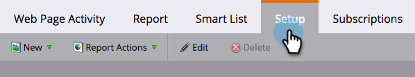

# 在Web報表中顯示人物或匿名訪客{#display-people-or-anonymous-visitors-in-web-reports}

>[!PREREQUISITES]
>
>[將Munchkin追蹤程式碼新增至您的網站](/help/marketo/product-docs/administration/additional-integrations/add-munchkin-tracking-code-to-your-website.md)

在[「網頁活動」](/help/marketo/product-docs/reporting/basic-reporting/report-types/web-page-activity-report.md)和[「公司網頁活動」報表](/help/marketo/product-docs/reporting/basic-reporting/report-types/company-web-activity-report.md)中，您可以看到瀏覽您網站的[訪客或匿名訪客](/help/marketo/product-docs/core-marketo-concepts/smart-lists-and-static-lists/managing-people-in-smart-lists/understanding-anonymous-activity-and-people.md)。 匿名訪客已推斷資料，例如地鐵區。  以下是如何選擇報表顯示已知潛在客戶或匿名訪客的方式。

1. 在「網頁活動」報表中，按一下「**設定**」。

   

1. 按兩下&#x200B;**活動源**。

   

1. 在彈出式選單中，從下拉式清單中選擇&#x200B;**已知銷售機會**（人員）或&#x200B;**匿名訪客**。

   

   >[!NOTE]
   >
   >包含匿名訪客的ISP會產生較長的報表，但排除這些報表可更清楚瞭解訪客來自標準來源（例如Google）以外的位置。

1. 就這樣。 按一下&#x200B;**報表**&#x200B;標籤，返回並與已知或匿名人員檢視報表。

   

>[!MORELIKETHIS]
>
>[追蹤匿名活動與人員](/help/marketo/product-docs/reporting/basic-reporting/report-activity/tracking-anonymous-activity-and-people.md)
