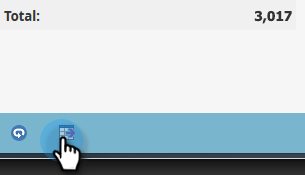

# 在人員效能報告中深入研究 {#drill-down-in-a-people-performance-report}

深入查看人員績效報表以查看其他人員資訊。

1. 按一下 **報表** 標籤來檢視任何現有報表。

   

1. 在報表中選取您要進一步了解的一列。

   

1. 按一下 **向下切入**.

   

1. 在 **向下切入** 彈出式清單中，選擇要細化到的屬性。 然後按一下 **向下切入**.

   

1. 幹得好！ 將在新索引標籤中開啟向下切入報表。 現在您可以探索新報表。

   >[!TIP]
   >
   >如果您沒有看到新的報表標籤開啟，則您的瀏覽器可能會封鎖快顯視窗。 變更瀏覽器設定以允許。

   

1. 若要儲存結果（選用），請按一下 **匯出** 圖示。

   
