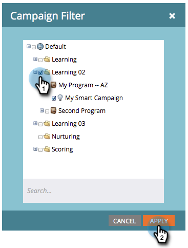

# 篩選促銷活動報告 {#filter-a-campaign-activity-report}

將[行銷活動報告](/help/marketo/product-docs/reporting/basic-reporting/report-types/campaign-activity-report.md)的焦點放在特定的[智慧行銷活動](/help/marketo/product-docs/core-marketo-concepts/smart-campaigns/creating-a-smart-campaign/understanding-batch-and-trigger-smart-campaigns.md)。

>[!NOTE]
>
>衛星模式不支援在報表中篩選資產（資產詳細資料頁面右側的「在新視窗中開啟」圖示）。

1. 移至&#x200B;**行銷活動** （或&#x200B;**Analytics**）並選取您的行銷活動報告。

   

1. 按一下&#x200B;**設定**&#x200B;標籤，然後按兩下&#x200B;**行銷活動**。

   

1. 選擇要包含在報表中的資料夾和特定智慧行銷活動。 按一下&#x200B;**套用**。

   

   >[!TIP]
   >
   >如果您選取資料夾，報表會包含報表執行時資料夾所包含的所有內容。

1. 您已完成！ 按一下「**報表**」索引標籤，檢視報表中選取的&#x200B;_智慧型行銷活動_。

   

>[!MORELIKETHIS]
>
>[行銷活動電子郵件效能報告](/help/marketo/product-docs/reporting/basic-reporting/report-types/campaign-email-performance-report.md)
