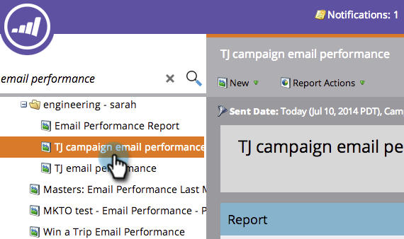

# 篩選行銷活動電子郵件報告中的資產 {#filter-assets-in-a-campaign-email-reports}

將[行銷活動電子郵件成效](/help/marketo/product-docs/reporting/basic-reporting/report-types/campaign-email-performance-report.md)報告集中在方案（「本機資產」）中的特定[智慧行銷活動](/help/marketo/product-docs/core-marketo-concepts/smart-campaigns/creating-a-smart-campaign/understanding-batch-and-trigger-smart-campaigns.md)或已封存的行銷活動。

>[!NOTE]
>
>衛星模式不支援在報表中篩選資產（資產詳細資料頁面右側的「在新視窗中開啟」圖示）。

1. 移至&#x200B;**Analytics** （或&#x200B;**行銷活動**）區域。

   

1. 選取您的電子郵件效能報表。

   

1. 按一下「**[!UICONTROL Setup]**」索引標籤並拖曳至篩選器上。

   

   * **[!UICONTROL Campaigns]**：在您的Marketo帳戶中使用中的智慧型行銷活動。
   * **[!UICONTROL Archived Campaigns]**：非作用中、已淘汰的智慧行銷活動。

1. 選擇要包含在報表中的資料夾和特定智慧行銷活動。

   

   >[!TIP]
   >
   >如果您選取資料夾，報表會包含報表執行時資料夾所包含的所有內容。

1. 完成了！ 按一下「**[!UICONTROL Report]**」索引標籤以檢視篩選的報告。

   

   >[!MORELIKETHIS]
   >
   >[行銷活動電子郵件效能報告](/help/marketo/product-docs/reporting/basic-reporting/report-types/campaign-email-performance-report.md)
   >[在電子郵件報告中篩選Assets](/help/marketo/product-docs/reporting/basic-reporting/report-activity/filter-assets-in-an-email-report.md)
