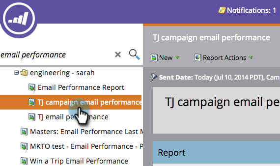

# 篩選促銷活動電子郵件報表中的資產{#filter-assets-in-a-campaign-email-reports}

將您的[促銷活動電子郵件績效](../../../../product-docs/reporting/basic-reporting/report-types/campaign-email-performance-report.md)報告集中在您的程式（「本機資產」）中的特定[智慧型促銷活動](https://docs.marketo.com/display/docs/smart+campaigns)或已封存的促銷活動上。

1. 前往**Analytics **（或&#x200B;**行銷活動**）區域。

   

1. 選擇您的電子郵件績效報告。

   

1. 按一下「**Setup**」標籤，並拖曳至篩選器上。

   

   * **促銷活動**:您Marketo帳戶中的作用中智慧型促銷活動。
   * **封存的促銷活動**:停用的智慧型促銷活動。

1. 選擇要包含在報表中的資料夾和特定智慧型促銷活動。

   

   >[!TIP]
   >
   >如果您選取資料夾，您的報表將包含資料夾在報表執行時包含的所有項目。

1. 你完了！ 按一下&#x200B;**報表**&#x200B;標籤，查看您的篩選報表。

   

   >[!MORELIKETHIS]
   >
   >
   >    
   >    
   >    * [促銷活動電子郵件績效報表](../../../../product-docs/reporting/basic-reporting/report-types/campaign-email-performance-report.md)
   >    * [篩選電子郵件報表中的資產](filter-assets-in-an-email-report.md)

   >[!NOTE]
   >
   >**深入探討**
   >
   >
   >瞭解[基本報表](https://docs.marketo.com/display/docs/basic+reporting)中的所有報表。

