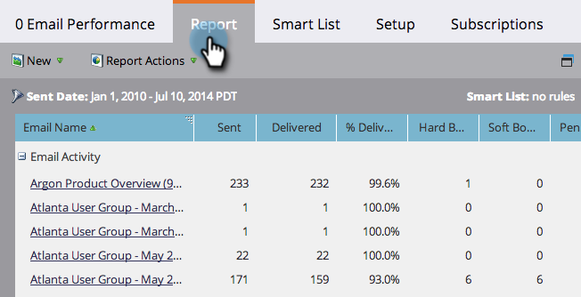

# 篩選電子郵件報告中的資產 {#filter-assets-in-an-email-report}

將您的[電子郵件效能](/help/marketo/product-docs/email-marketing/email-programs/email-program-data/email-performance-report.md)或[電子郵件連結效能](/help/marketo/product-docs/email-marketing/email-programs/email-program-data/email-link-performance-report.md)報告集中在您的程式（「本機資產」）中的電子郵件、Design Studio中的電子郵件（「全域資產」）或已封存的電子郵件上。

>[!NOTE]
>
>衛星模式不支援在報表中篩選資產（資產詳細資料頁面右側的「在新視窗中開啟」圖示）。

1. 移至&#x200B;**Analytics** （或&#x200B;**行銷活動**）區域。

   

1. 選取您的電子郵件報表。

   

1. 按一下「**[!UICONTROL Setup]**」索引標籤並拖曳至篩選器上。

   

   * **[!UICONTROL Design Studio Emails]**：全域資產，在Design Studio中管理。
   * **[!UICONTROL Marketing Activities Emails]**：行銷活動標籤上方案中的本機資產。
   * **封存的電子郵件**：非使用中、已淘汰的電子郵件。

1. 選擇要包含在報告中的資料夾和特定電子郵件。

   

   >[!TIP]
   >
   >如果您選取資料夾，報表會包含報表執行時資料夾所包含的所有內容。

1. 完成了！ 按一下「**[!UICONTROL Report]**」索引標籤以檢視篩選的報告。

   

>[!MORELIKETHIS]
>
>[在行銷活動電子郵件報告中，篩選Assets](/help/marketo/product-docs/reporting/basic-reporting/report-activity/filter-assets-in-a-campaign-email-reports.md)
