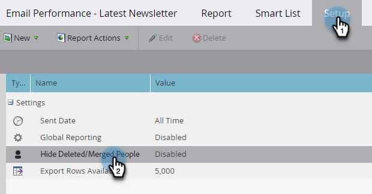

# 篩選電子郵件效能報告中已刪除/已合併的記錄 {#filter-deleted-merged-records-in-an-email-performance-report}

將您的電子郵件效能報表集中於程式（「本機資產」）中的電子郵件、Design Studio中的電子郵件（「全域資產」），或已封存的電子郵件。

>[!NOTE]
>
>衛星模式不支援在報表中篩選資產（資產詳細資料頁面右側的「在新視窗中開啟」圖示）。

1. 前往&#x200B;**Analytics** （或行銷活動）區域。

   

1. 選取您的電子郵件效能報表。

   

1. 按一下「**設定**」標籤，然後選取「**隱藏已刪除/合併的人員**」。

   

1. 按一下下拉式清單，選取&#x200B;**已啟用**，然後按一下&#x200B;**儲存**。

   

您已完成！ 按一下「報表」標籤，檢視篩選後的報表。
